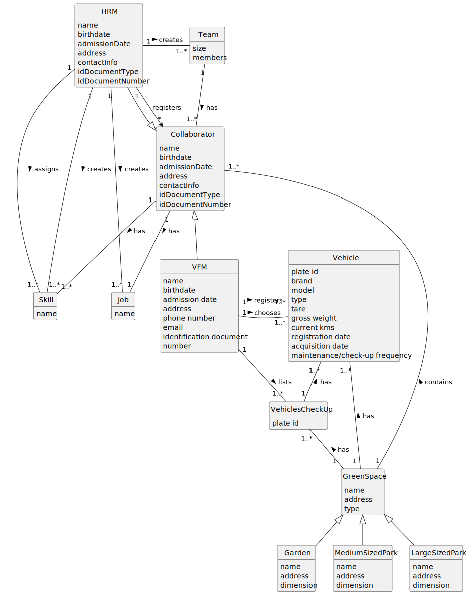

# Green Space Management Application User Manual

## Glossary

To access the glossary, click [here](01.requirements-engineering/glossary.md).

## Introduction

This document as the purpose to explain the app being developed with the idea of showing his purposes and objectives,
and give instructions on how to use it. 
In this manual, it is possible to find the system structure along with the system overview, 
the main features of the product, a structure diagram and features of the app. 
This manual is addressed to the users of the product, specifically the green spaces managers and administrators. 

## System Overview

The main goal of the system developed under this project is to offer an integrated solution for the effective 
management of green spaces for collective use, such as gardens and parks, to be used by town and parish councils.
This application is designed to optimize operations related to the maintenance and planning of these spaces, facilitating 
the management of multidisciplinary teams, the allocation of resources, the control of fleets and equipment, the 
optimization of irrigation and lighting systems, and the production of statistical indicators that make it possible to 
assess the performance of the activities carried out.

### System Structure

The structure of the application is organized around several main modules that interact with each other to offer 
cohesive and integrated management of green spaces:

1. **Collaborator Management**: This module is responsible for registering and managing collaborators, including their 
competences, functions, and assignment to teams. It allows the Human Resources Manager (HRM) to create and manage
collaborators' profiles, record their skills and associate them with specific tasks.

2. **Team Management**: Facilitates the creation and management of multidisciplinary teams, allowing the HRM to compose 
teams based on the skills required to carry out the tasks in the various green spaces.

3. **Vehicle and Equipment Management**: This module allows the Vehicle and Equipment Fleet Manager (FM) to register 
and control vehicles and equipment, ensuring their proper maintenance and availability for scheduled tasks.

### Main Features

- Flexible Resource Management: The application provides flexible management of collaborators, teams, vehicles, and 
equipment, adapting to the dynamic needs of green space management.

### Structural Diagram

This diagram illustrates the modular organization of the application so far and the key interactions between the 
different components of the system, offering a clear view of its structure and integrated operation.

## Features
> ### 1. Register skills | HRM
> **Purpose:** To enable the Human Resources Manager (HRM) to create a skill or set of skills to later be added to a Collaborator/Employee.
>
> **Instructions**:
> - Log in to your Human Resources Manager account;
> - Navigate to the section where you can add skills;
> - Write the skill or set of skills to be added;
> - Click on "Add skill" or a similar option to automatically add the skill to the program, after you confirm it.

> ### 2. Register a Profession | HRM
> **Purpose:** To enable the Human Resources Manager (HRM) to create a skill or set of skills to later be added to a Collaborator/Employee.
>
> **Instructions**:
> - Log in to your Human Resources Manager account;
> - Navigate to the section where you can assign a job to a collaborator;
> - Write the job to be added, and the name of the person who will do that job;
> - Click on "Add Job" or a similar option to automatically add the job to the employee, after you confirm it.

> ### 3. Registration of an employee | HRM
> **Purpose:** To facilitate the Human Resources Manager (HRM) in the process of registering new employees in the system, ensuring that all necessary personal and professional information is accurately captured.
> 
> **Instructions**:
> - Log in to your Human Resources Manager account;
> - Navigate to the "Employee Management" or a similar section;
> - Choose the option to register a new employee;
> - Enter the required employee details, such as name, birth date, admission date, address, contact info (phone number and email), taxpayer number, ID document type, and ID document number;
> - Review the entered information for accuracy;
> - Click on "Register Employee" or a similar option to complete the registration process, after confirming the accuracy of the information provided.

> ### 4. Assigning skills to an employee | HRM
> **Purpose:** This feature is designed to enable the Human Resources Manager (HRM) to assign specific skills to employees, thereby facilitating better job-role alignment and enhancing the organization's talent management process.
> 
> **Instructions**:
> - Log in to your Human Resources Manager account;
> - Navigate to the "Skill Management" or a similar section;
> - Select the employee to whom you wish to assign skills;
> - Search or browse through the list of available skills;
> - Select one or more skills that match the employee's qualifications and job requirements;
> - Click on "Assign Skills" or a similar option to finalize the assignment of selected skills to the employee, after you confirm the selection.

> ### 5. Generate a Team Proposal | HRM
> **Purpose:** To enable the Human Resources Manager (HRM) to automatically generate a team proposal based on the 
minimum and maximum size of the team and the set of skills required for a given task.
> 
> **Instructions**:
> - Log in to your Human Resources Manager account;
> - Navigate to the section where you can create a team;
> - Enter the desired minimum and maximum team size;
> - Select the necessary skills from the available list (skills already registered by an HRM);
> - Click on "Generate Team" or a similar option to automatically create a team proposal based on the criteria specified.

> ### 6. Register a vehicle | VFM
> **Purpose:** To enable the Vehicle Fleet Manager (VFM) to register a new vehicle.
> 
> **Instructions:**
> - Log in to your Vehicle Fleet Manager account;
> - Navigate to the section where you can register a new vehicle;
> - Write the attributes of the vehicle;
> - Click on "Register vehicle" or a similar option to add the vehicle, after you confirm.

> ### 7. Register a vehicle's check-up | VFM
>

> ### 8. List vehicles that need to be serviced | VFM
> **Purpose:** To enable the Vehicle Fleet Manager (VFM) to automatically generate a list of all vehicles that need a check-up.
> 
> **Instructions**:
> - Log in to your Vehicle Fleet Manager account;
> - Navigate to the section where you can list all vehicles that need a check-up;
> - Click on "Generate list" or a similar option to automatically create a list of all vehicles that need a check-up, after you confirm it.
