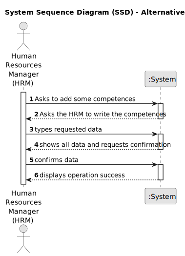
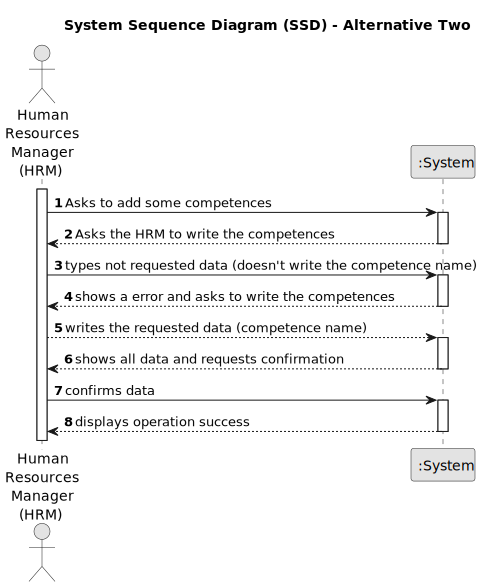
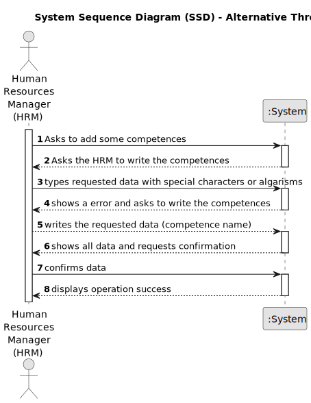

# US001 - Register skills

## 1. Requirements Engineering

### 1.1. User Story Description

As a HRM I want to record competences that can be attributed to an employee.

### 1.2. Customer Specifications and Clarifications 

**From the specifications document:**

>	Each task is characterized by having a unique reference per organization, a designation, an informal and a technical description, an estimated duration and cost, as well as a task category. 

>	As long as it is not published, access to the task is exclusive to the employees of the respective organization. 

**From the client clarifications:**

> **Question:** What criteria are required to register a skill?
>
> **Answer:** the skill name, for example:
> 
> pruner; heavy goods vehicle driver; phytopharmaceutical applicator
>
> **Question:** When you create a skill that already exists, what should the system do?
>
> **Answer:** By definition it is not possible to have duplicate values in a set. Checking for duplicates is not a business rule, it's at the technological level.
> 
> **Question:** Do I need to add skills  by writing them or can I just give a file with all of the skills?
> 
> **Answer:** Both are acceptable since the business the same the crucial difference resides in the UX.
> 
> **Question:** Does the HRM need to see the confirmation of the sucess of the operation and the skills added or just the sucess of the operation?
> 
> **Answer:** It will depend if you opt to insert one skil or a set of skils in a batch. Maybe some adaptation needed.
> 
> **Question:** Is there any other possible outcome like if the HMR does not put the requested data, do I need to ask the user to to register a diferent competence?
> 
> **Answer:** This US is quite simple, atm a skill is simply a name.
> 
> **Question:** Which are the skills accepted? Or should we enable the HRM to introduce anything as a skill?
> 
> **Answer:** All, it's up to HRM to decide. (special characters or algarisms should not be allowed in the skill name)

### 1.3. Acceptance Criteria

* **AC1:** The HRM needs to write at least one competence.
* **AC2:** It must be a String.
* **AC3:** If it is not a String ask again for competences.
### 1.4. Found out Dependencies

* There are no dependencies in other US.

### 1.5 Input and Output Data

**Input Data:**

* Typed data:
    * a competence (The name of the competence)
  
	
* Selected data:
    * array with the information of the competences

**Output Data:**

* Information of the competences that were recorded!
* (In)Success of the operation

### 1.6. System Sequence Diagram (SSD)

#### Alternative One

#### Alternative Two

#### Alternative Three

### 1.7 Other Relevant Remarks

* The data acquired in this US (competences), will be saved in an array so then it can be used later in  other US.