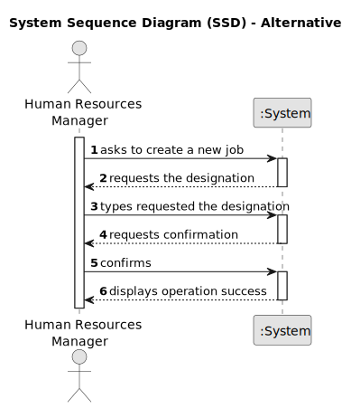
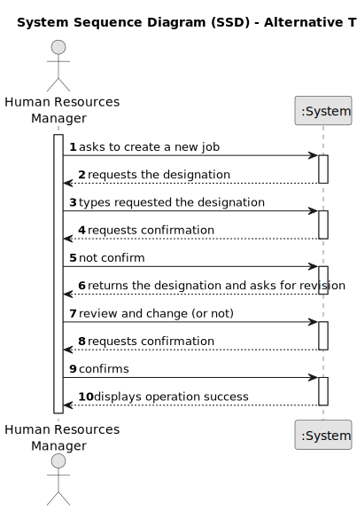

# US002 - Register a Job 

## 1. Requirements Engineering

### 1.1. User Story Description

As an HRM I want to register a profession.

### 1.2. Customer Specifications and Clarifications 

**From the specifications document:**

>

**From the client clarifications:**

> **Question:** Is it relevant to associate a specific area or sector with each Job? (For example, "Gardener" would be inserted in the "Maintenance" sector).
>
> **Answer:** It's not necessary as there are no US states that suggest it might be necessary.

> **Question:** Should information such as salary, type of employment (full-time or part-time), and working method (face-to-face, remote or hybrid) be included in the Job? Or is this information better suited to the employee, or perhaps not necessary at all?
>
> **Answer:** It's not necessary as there are no US states that suggest it might be necessary.

> **Question:** What other information do you think needs to be associated with the Job?
>
> **Answer:** None yet.

> **Question:** What are the acceptance criteria? When are creating a job that already exit, what the system do?
>
> **Answer:** By definition a set can´t have duplicates. Assuring no duplicates is not a business rule is a tecnichal issue.

> **Question:** What are the inputs for creating a job?
>
> **Answer:** The name of job: gardener; cobbler; electrician; driver; ...

### 1.3. Acceptance Criteria

* **AC1:** It should not be possible to register a new profession if it already exists in the system.

### 1.4. Found out Dependencies

* There is a dependency on **"US001 - Register Competences"** since there must be at least one competence to assign to the profession being created.

### 1.5 Input and Output Data

**Input Data:**

* Typed data:
    * a designation
	
* Selected data:

**Output Data:**

* List of all registered professions
* (In)Success of the operation

### 1.6. System Sequence Diagram (SSD)

**_Other alternatives might exist._**

#### Alternative One

#### Alternative Two

#### Alternative Three

### 1.7 Other Relevant Remarks

