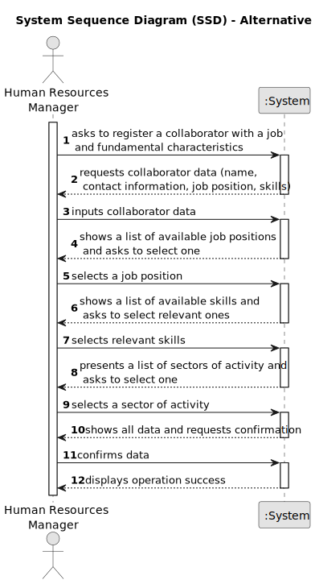
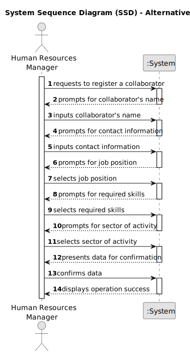

# US003 - Registration of an employee

## 1. Requirements Engineering

### 1.1. User Story Description

As an HRM, I want to register a collaborator with a job and fundamental characteristics.

### 1.2. Customer Specifications and Clarifications

**From the specifications document:**

> ...

**From the client clarifications:**

> **Question:** Na User Story 03 é mencionado o termo 'características fundamentais'. A minha questão é, precisamente, quais são estas características.
>
> **Answer:** Os dados essenciais do colaborador mínimos serão nome, data de nascimento, data de admissão, morada, contacto (telefonico e email), documento de identificação e o seu número. Podem considerar outros que entendam ser relevantes.
>
> **Question:** 1. Esse número tem algum formato em particular? 2. Como é que é suposto esse ser criado? Automaticamente pelo sistema ou manualmente pelo HRM?
>
> **Answer:** Não faz sentido gerar um número que representa a identificação de uma pessoa. As pessoas têm documentos de identificação (CC, BI, Passaporte) cujos números já foram atribuidos.
>
> **Question:** What is needed for the adress ?  Street, zipcode and a city?
>
> **Answer:**
That would be enough.
> 
> **Question:** Should the system able the HRM to insert multiple collaborators in one interaction before saving them.
>
> **Answer:** it's not required to do so.
> 
> **Question:** I have some questions regarding the business rules of this US: - Is there any limitation regarding the length of the name of the collaborator? - Should we consider valid only the birthdates in which the collaborator has more than 18 years? - What should be the format for the phone number? 9 numbers? - What is the format for the numbers from the id doc types? - Are there any other business rules
>
> **Answer:**
According to the Portuguese law a name should contain at maximum six words;
yes; validating 9 digits will be acceptable; validating with international format would be excelent;
each doc type has specific formats like taxpayer number, Citizen Card ou passport.
> 
> **Question:** Which information is mandatory to insert a collaborator in the program (fundamental characteristics)? Does the HRM select the job from a list that we display?
>
> **Answer:** - name, birth date, admission date, address, contact info (mobile and email), taxpayer number, ID doc type and respective number - displaying or not, It's a matter of UX, the dev team should decide about it, but the valid jobs are the ones created within the US02.
>
> **Question:** When creating a collaborator with an existing name ... What the system do?
What characteristics are important to success the register?
>
> **Answer:**
It's not common and most improbable to have different individual with same name in the same context, however it’s ID documentation number should be unique for sure.
I believe that question was already answered, name, birthdate, admission date, id doc type, id doc number, contact info (email, mobile), address.

### 1.3. Acceptance Criteria

* **AC1:** All mandatory fields for the collaborator registration must be completed, including name, date of birth, date of admission, address, contact information (phone and email), identification document, and document number.
* **AC2:** AC2: The collaborator's reference must contain at least 5 alphanumeric characters and be unique within the system.
* **AC3:** If a collaborator with an existing name is being registered, the system should handle this scenario by prompting the user to modify the name to ensure uniqueness.
* **AC4:** Upon successful registration, the system should provide a confirmation message indicating the success of the operation.
* **AC5:** In case of failure during registration due to missing or invalid data, the system should display appropriate error messages indicating the specific issues that need to be addressed.

### 1.4. Found out Dependencies

* Dependency on US001: Requires at least one competence to assign to the collaborator's job.
* Dependency on US002: Relies on predefined jobs within the system to assign to collaborators.

### 1.5 Input and Output Data

**Input Data:**

* Typed data:
    * Collaborator's personal information (e.g., name, email, phone number).
    * Job-related information (e.g., job title, department).
    * Fundamental characteristics (e.g., skills, competences).

* Selected data:
    * Job selection from predefined options.

**Output Data:**

* Success/Failure Confirmation: Indicates whether the registration operation was successful or not.
* Updated Collaborator Database: Includes the newly registered collaborator's information.

### 1.6. System Sequence Diagram (SSD)

**_Other alternatives might exist._**

#### Alternative One

#### Alternative Two

### 1.7 Other Relevant Remarks

* The created task stays in a "not published" state in order to distinguish from "published" tasks.