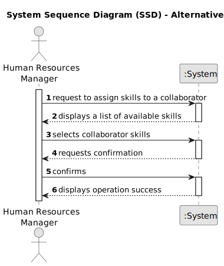
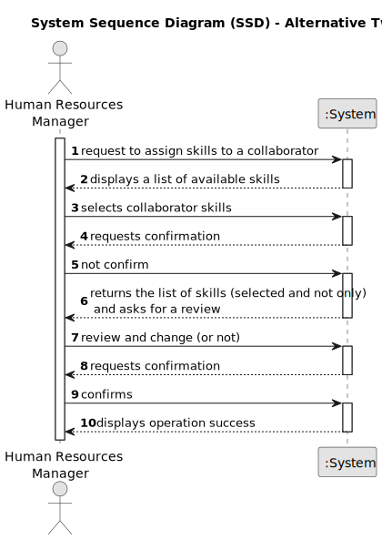

# US004 - Assigning competences to an employee 

## 1. Requirements Engineering

### 1.1. User Story Description

As an HRM, I want to assign one or more skills to a collaborator.

### 1.2. Customer Specifications and Clarifications 

**From the specifications document:**

>	

>	

**From the client clarifications:**

> **Question:** Na US04 é relativa à associação de skills a um colaborador. A minha questão é: 1. se há um número mínimo e máximo de número de skills; 2. se há alguma característica especial que seja necessária o colaborar ter para que lhe sejam adicionadas estas skills.

>
> **Answer:** 1. Não; 2. Não.

> **Question:* *1 -Is there a maximum number of skills a collaborator can be added to?
2- Can more skills be added over time?
3- Can there be collaborators without associated skills?
>
> **Answer:** 

> **Question:** Regarding registering a skill, we have a couple of questions: Can any skill be registered to any collaborator/job? Or should they be associated in categories in association with a specific job; Should it be possible to add the same skill to a collaborator multiple times?; Is there any certification/proof needed to register a skill to a colaborator?
>
> **Answer:** -There is no association, it totally depends of the CV of the collaborator.
-That does not make sense -no.

> **Question:**
>
> **Answer:**

### 1.3. Acceptance Criteria

* **AC1:** The system should display a list of available competences for selection.
* **AC2:** HRM should be able to select one or more competences from the list and assign them to the collaborator.
* **AC3:** HRM should have the ability to remove assigned competences from the collaborator's profile if necessary.
* **AC4:** Once competences are assigned or removed, the system should update the collaborator's profile with the changes.
* **AC5:** The system should provide feedback to HRM confirming the success or failure of the competence assignment operation

### 1.4. Found out Dependencies

* Dependency on US001: Requires competences to be previously registered in the system to be available for assignment.
* Dependency on US003: Collaborator must be registered in the system before competences can be assigned to them.

### 1.5 Input and Output Data

**Input Data:**

* Typed data:
 
	
* Selected data:
    * Competences to be assigned to the collaborator.

**Output Data:**

* Success/Failure Confirmation: Indicates whether the competence assignment operation was successful or not.
* Updated Collaborator Profile: Includes the collaborator's information with the newly assigned competences.

### 1.6. System Sequence Diagram (SSD)

**_Other alternatives might exist._**

#### Alternative One

#### Alternative Two

### 1.7 Other Relevant Remarks

* The created task stays in a "not published" state in order to distinguish from "published" tasks.