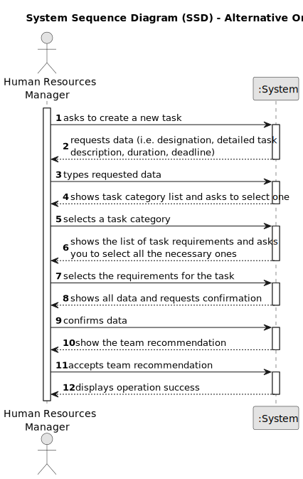
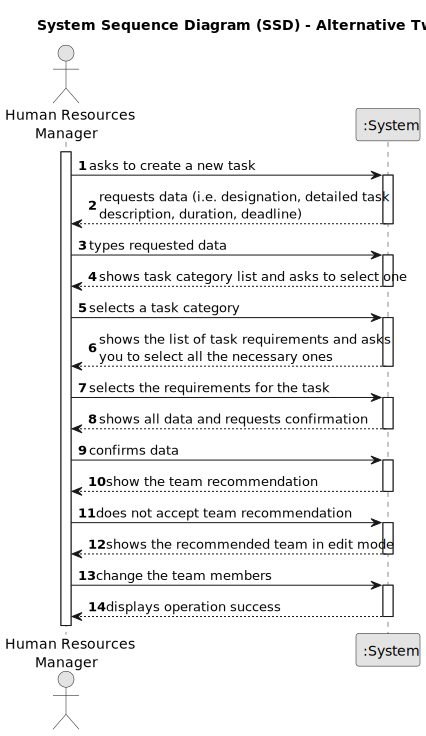
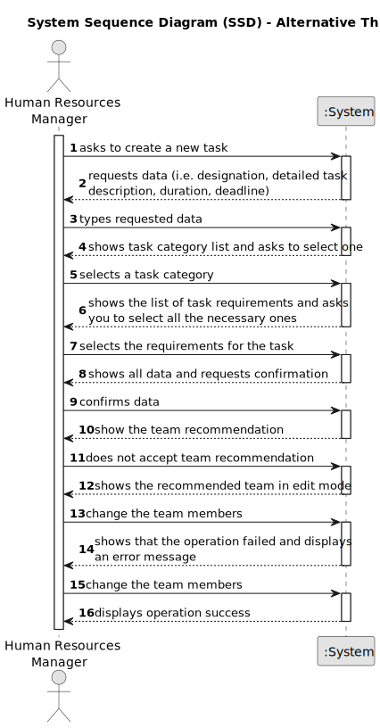

# US005 - Generate a Team Proposal 

## 1. Requirements Engineering

### 1.1. User Story Description

As a HRM, I want to generate a team proposal automatically.

### 1.2. Customer Specifications and Clarifications 

**From the specifications document:**

>

**From the client clarifications:**

> **Question:** How does it generate the team if there are not enough employees?
>
> **Answer:** The system should provide information why it can't generate a team.

> **Question:** How does he purpose a team, for what purpose? (Is there any default)?
>
> **Answer:** There is no purpose, at least in this sprint.

> **Question:** What are the input data to automatically generate a team?
>
> **Answer:** The max size of the team (for instance 4); The skill needed: 4 tree pruner and 1 light vehicle driver (meaning that one team member have 2 skills).

> **Question:** Is it necessary for the user to enter the minimum number of members required for a team?
> 
> **Answer:** Yes.

### 1.3. Acceptance Criteria

* **AC1:** The maximum team size and the set of skills need to be supplied by the HRM.
* **AC2:** The minimum team size should also be provided by HRM.

### 1.4. Found out Dependencies

* There is a dependency on **"US003 - Registration of an employee"** since it needs information about the employees, such as experience and skills. This allows the system to select the appropriate employees to form the team.
* There is a dependency on **"US004 - Assigning skills to an employee"** since skills need to be assigned to employees in the system. The system will have to take the relevant competences into account when forming teams.

### 1.5 Input and Output Data

**Input Data:**

* Typed data:
    * a maximum team size
    * a minimum team size
	
* Selected data:
    * the necessary skills

**Output Data:**

* (In)Success of the operation
* A team recommendation

### 1.6. System Sequence Diagram (SSD)

**_Other alternatives might exist._**

#### Alternative One

#### Alternative Two

#### Alternative Three

### 1.7 Other Relevant Remarks

* The HRM can change the team's recommendation and will be notified if none of the members have the necessary skills to carry out the task.