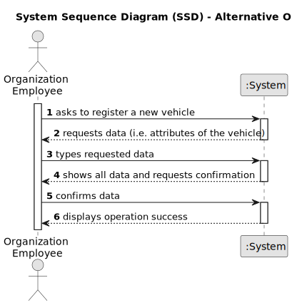

# US006 - Register a vehicle 

## 1. Requirements Engineering

### 1.1. User Story Description

The GPV wants to register a vehicle.

### 1.2. Customer Specifications and Clarifications 

**From the project statement document:**

>	The vehicle as the following attributes: Brand, Model, Type, Tare, Gross weight, Current Kms, Registration Date, Acquisition Date and Service Frequency (in Kms). 

**From the client clarifications:**

> **Question:** Which is the unit of measurement used to estimate duration?
>
> **Answer:** Duration is estimated in days.

> **Question:** Monetary data is expressed in any particular currency?
>
> **Answer:** Monetary data (e.g. estimated cost of a task) is indicated in POT (virtual currency internal to the platform).

### 1.3. Acceptance Criteria

* **AC1:** The attributes used to describe a vehicle are: Brand, Model, Type, Tare, Gross weight, Current Kms, Registration Date, Acquisition Date and Service Frequency (in Kms).

### 1.4. Found out Dependencies

* No dependencies were found.

### 1.5 Input and Output Data

**Input Data:**

* Typed data:
    * a designation 
    * an informal description
    * a technical description
    * the attributes of the vehicle
	
* Selected data:

**Output Data:**

* (In)Success of the operation

### 1.6. System Sequence Diagram (SSD)

**_Other alternatives might exist._**

#### Alternative One

#### Alternative Two

### 1.7 Other Relevant Remarks

* The created task stays in a "not published" state in order to distinguish from "published" tasks.