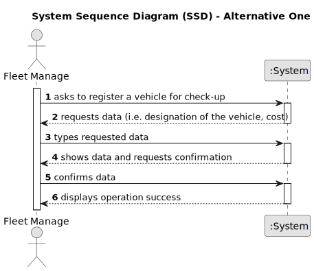
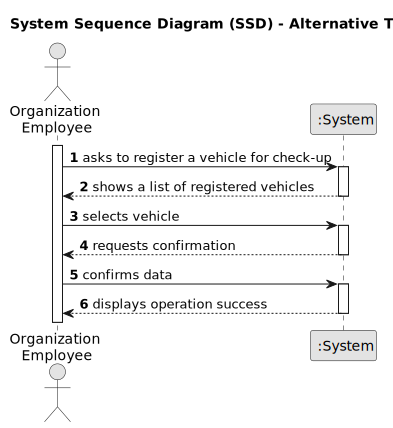

# US007 - Register a vehicle's check-up

## 1. Requirements Engineering

### 1.1. User Story Description

The FM wants to register a vehicles check-up.

### 1.2. Customer Specifications and Clarifications 

**From the specifications document:**

>	Each task is characterized by having a unique reference per organization, a designation, an informal and a technical description, an estimated duration and cost, as well as a task category. 

>	As long as it is not published, access to the task is exclusive to the employees of the respective organization. 

### 1.3. Acceptance Criteria

* **AC1:** All required fields must be filled in.
* **AC2:** The chosen vehicle must be a registered vehicle.

### 1.4. Found out Dependencies

* There is a dependency on "US006 - Register a vehicle" as there must be at least one vehicle registered so that it can be inspected.

### 1.5 Input and Output Data

**Input Data:**

* Typed data:
    * a designation of the registered vehicle

**Output Data:**

* (In)Success of the operation

### 1.6. System Sequence Diagram (SSD)

**_Other alternatives might exist._**

#### Alternative One

#### Alternative Two

### 1.7 Other Relevant Remarks

* The created task stays in a "not published" state in order to distinguish from "published" tasks.