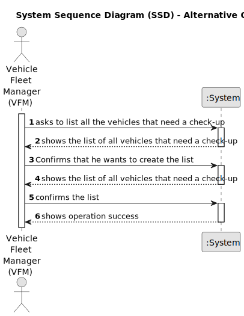

# US008 - List vehicles that need to be serviced 

## 1. Requirements Engineering

### 1.1. User Story Description

As an FM, I want to list the vehicles needing the check-up.

### 1.2. Customer Specifications and Clarifications 

**From the specifications document:**

>	Each task is characterized by having a unique reference per organization, a designation, an informal and a technical description, an estimated duration and cost, as well as a task category. 

>	As long as it is not published, access to the task is exclusive to the employees of the respective organization. 

**From the client clarifications:**

> **Question:** Can the vehicles get placed automatically on a list or the one listing has to be the FM?
>
> **Answer:** The list of vehicles is automatically created but the creation is triggered by the FM.

> **Question:** What information will appear on the final list regarding the vehicle,besides the needing for check-up?
>
> **Answer:** Data that allow to identify the vehicle like Plate, brand and module, as well as, the data that allowed to select/insert te vehicle in the list, number of kms, frequency of checkup and the last checkup.

### 1.3. Acceptance Criteria

* **AC1:** There must be at least one vehicle that is listed to do a check-up.

### 1.4. Found out Dependencies

* There is a dependency on "US007 - Register a vehicle's check-up" as there must be at least one vehicle registered to being in need of a check-up.

### 1.5 Input and Output Data

**Input Data:**

* Typed data:
    * Some mention of a confirmation to create the list
	

* Selected data:
    * Vehicles that need a check-up. 

**Output Data:**

* List of cars to the check-up
* (In)Success of the operation

### 1.6. System Sequence Diagram (SSD)

#### Alternative One

### 1.7 Other Relevant Remarks

* The data that allow to identify the vehicle like Plate, brand and module, as well as, the data that allowed to select/insert te vehicle in the list, number of kms, frequency of checkup and the last checkup, are necessary to put in the list.
