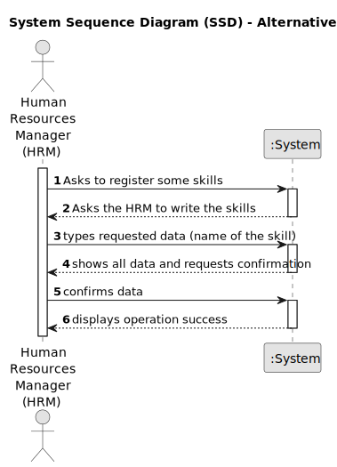

# US001 - Register Skills

## 1. Requirements Engineering

### 1.1. User Story Description

As a Human Resources Manager (HRM), I want to register skills that a
collaborator may have.

### 1.2. Customer Specifications and Clarifications 

**From the client clarifications:**

> **Question:** What criteria are required to register a skill?
>
> **Answer:** the skill name, for example:
> 
> pruner; heavy goods vehicle driver; phytopharmaceutical applicator

> **Question:** When you create a skill that already exists, what should the system do?
>
> **Answer:** By definition, it is not possible to have duplicate values in a set. Checking for duplicates is not a business rule, it's at the technological level.
 
> **Question:** Do I need to add skills by writing them or can I just give a file with all the skills?
> 
> **Answer:** Both are acceptable since the business the same the crucial difference resides in the UX.

> **Question:** Does the HRM need to see the confirmation of the success of the operation and the skills added or just the success of the operation?
> 
> **Answer:** It will depend on if you opt to insert one skill or a set of skills in a batch. Maybe some adaptation needed.

> **Question:** Is there any other possible outcome like if the HMR does not put the requested data, do I need to ask the user to register a different competence?
> 
> **Answer:** This US is quite simple, atm a skill is simply a name.
 
> **Question:** Which are the skills accepted? Or should we enable the HRM to introduce anything as a skill?
> 
> **Answer:** All, it's up to HRM to decide. (special characters or digits should not be allowed in the skill name)

> **Question:** The identifier of the skill will be the name, or the system will generate automatically and ID when the manager inserts the name? 
> 
> **Answer:** A skill is just a name, can be a composition of words like "Light Vehicle Driving Licence".
> 
> I have no knowledge about systems IDs.

> **Question:** Dear client, which is the difference between collaborator and employee?
> 
> **Answer:** Employee and collaborator are synonyms.

> **Question:** Should the system able the HRM to introduce multiple skills in one interaction before saving all of them?
> 
> **Answer:** It's not required to do so.

### 1.3. Acceptance Criteria

* **AC1:** The HRM needs to write at least one skill.
* **AC2:** It must not have any special character or digits.
* **AC3:** If the skill is not correctly created, it must be asked to the HRM to create again.

### 1.4. Found out Dependencies

* There are no dependencies in other US.

### 1.5 Input and Output Data

**Input Data:**

* Typed data:
    * a skill (The name of the skill)

* Selected data:
    * array with the information of the skills

**Output Data:**

* Information of the skills that were recorded!
* (In)Success of the operation

### 1.6. System Sequence Diagram (SSD)

#### Alternative One

