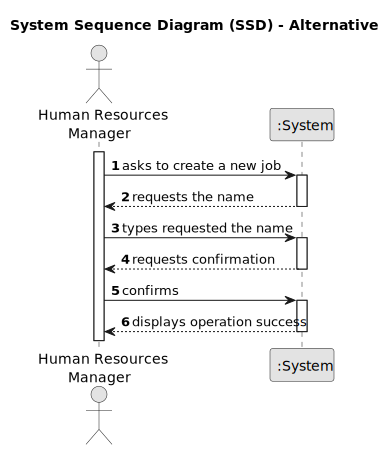

# US002 - Register a Job 

## 1. Requirements Engineering

### 1.1. User Story Description

As an HRM, I want to register a job that a collaborator needs to have.

### 1.2. Customer Specifications and Clarifications 

**From the client clarifications:**

> **Question:** Is it relevant to associate a specific area or sector with each Job? (For example, "Gardener" would be inserted in the "Maintenance" sector).
>
> **Answer:** It's not necessary as there are no US states that suggest it might be necessary.

> **Question:** Should information such as salary, type of employment (full-time or part-time), and working method (face-to-face, remote or hybrid) be included in the Job? Or is this information better suited to the employee, or perhaps not necessary at all?
>
> **Answer:** It's not necessary as there are no US states that suggest it might be necessary.

> **Question:** What other information do you think needs to be associated with the Job?
>
> **Answer:** None yet.

> **Question:** What are the acceptance criteria? When are creating a job that already exit, what the system do?
>
> **Answer:** By definition, a set can't have duplicates. Assuring no duplicates is not a business rule is a technical issue.

> **Question:** What are the inputs for creating a job?
>
> **Answer:** The name of job: gardener; cobbler; electrician; driver; ...

> **Question:** After registering a job/vehicle's checkup, should a message (success or failure) or a summary of the register appear?
> 
> **Answer:** The UX/UI is up to dev teams.

> **Question:** Should we add a description or anything attribute for the Job registration?
> 
> **Answer:** Not need to, a job is just a name.

> **Question:** The id of Job is generated automatically by the system?
> 
> **Answer:** Don't know what is job id, a job is just a name.

> **Question:** I guess a job can be assigned to a collaborator if he has the skills required for this job. How do we manage this relation? Does he HRM do it manually, or should we have an attribute in job specifying the skills needed?
>
> **Answer:** No; a collaborator is hired for a job and can have skills or not.

> **Question:** Does the job have to be registered before registering a collaborator?
> 
> **Answer:** A collaborator is hired for a (valid) job.

> **Question:** When we register a team, the collaborators have to have a job?
> 
> **Answer:** See 3 and 4.

> **Question:** What do you want to see as an output?
> 
> **Answer:** The UX/UI is to be decided by the dev team.

> **Question:** Can special characters and numbers be entered when registering a job?
> 
> **Answer:** No.

> **Question:** I assume that a job name cannot be empty. Is that right?
> 
> **Answer:** That's right.

### 1.3. Acceptance Criteria

* **AC1:** It should not be possible to register a new job if it already exists in the system.
* **AC2:** A job name can’t have special characters or digits.

### 1.4. Found out Dependencies

* There are no dependencies in other US.

### 1.5 Input and Output Data

**Input Data:**

* Typed data:
    * a designation

**Output Data:**

* List of all registered jobs
* (In)Success of the operation

### 1.6. System Sequence Diagram (SSD)

**_Other alternatives might exist._**

#### Alternative One

### 1.7 Other Relevant Remarks

