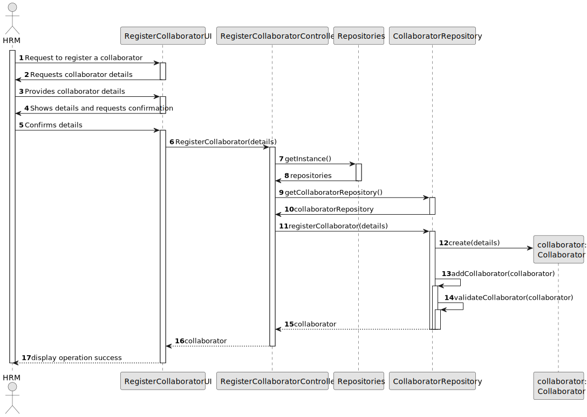
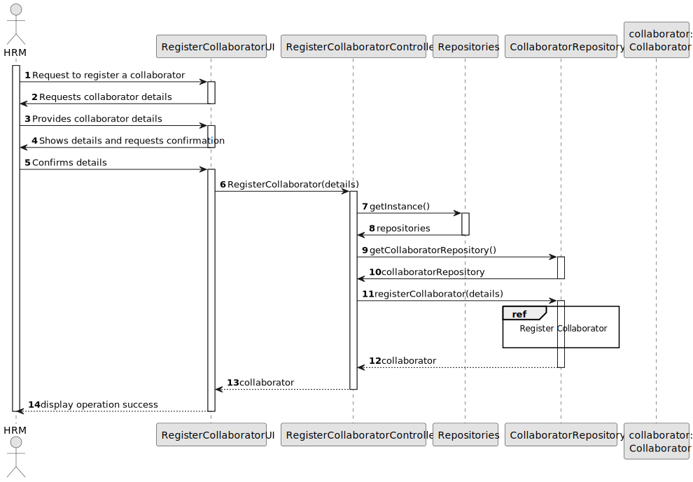
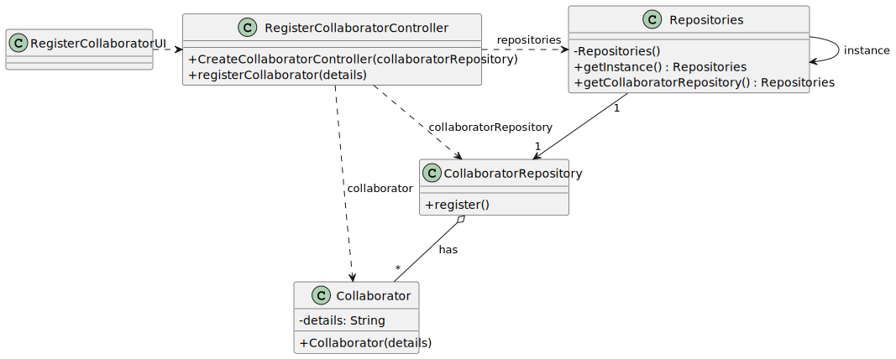

# US003 - Registration of an Employee

## 3. Design - User Story Realization

### 3.1. Rationale

_**Note that SSD - Alternative One is adopted.**_

| Interaction ID | Question: Which class is responsible for... | Answer               | Justification (with patterns)                                                                                                                                |
|:---------------|:--------------------------------------------|:---------------------|:-------------------------------------------------------------------------------------------------------------------------------------------------------------|
| Step 1         | ... interacting with the actor?             | CreateTaskUI         | Pure Fabrication: there is no reason to assign this responsibility to any existing class in the Domain Model.                                                |
|                | ... coordinating the US?                    | CreateTaskController | Controller: coordinates the interactions related to creating tasks in the user interface (UI) and executes the logic needed to process these requests. |
|                | ... instantiating a new Task?              | Organization         | Creator (Rule 1): in the DM Organization has a Task.                                                                                                         |
|                | ... knowing the user using the system?      | UserSession          | IE: cf. A&A component documentation.                                                                                                                        |
|                |                                              | Organization         | IE: knows/has its own Employees                                                                                                                             |
|                |                                              | Employee             | IE: knows its own data (e.g. email)                                                                                                                         |
| Step 2         | ... saving the inputted data?               | Task                 | IE: object created in step 1 has its own data.                                                                                                              |
| Step 3         | ... knowing the task categories to show?    | System               | IE: Task Categories are defined by the Administrators.                                                                                                      |
| Step 4         | ... saving the selected category?           | Task                 | IE: object created in step 1 is classified in one Category.                                                                                                 |
| Step 5         | ... validating all data (local validation)?| Task                 | IE: owns its data.                                                                                                                                          |
|                | ... validating all data (global validation)?| Organization       | IE: knows all its tasks.                                                                                                                                    |
|                | ... saving the created task?                | Organization         | IE: owns all its tasks.                                                                                                                                     |
| Step 6         | ... informing operation success?            | CreateTaskUI         | IE: is responsible for user interactions.                                                                                                                   |
                                                                 |
### Systematization ##

According to the taken rationale, the conceptual classes promoted to software classes are:

* Organization
* Employee

Other software classes (i.e. Pure Fabrication) identified:

* RegisterEmployeeUI
* RegisterEmployeeController

## 3.2. Sequence Diagram (SD)

_**Note that SSD - Alternative Two is adopted.**_

### Full Diagram

This diagram shows the full sequence of interactions between the classes involved in the realization of this user story.

### Split Diagrams

The following diagram shows the same sequence of interactions between the classes involved in the realization of this user story, but it is split into partial diagrams to better illustrate the interactions between the classes.

It uses Interaction Occurrence (a.k.a. Interaction Use).

**Get Employee Object**

**Create Employee**

## 3.3. Class Diagram (CD)

