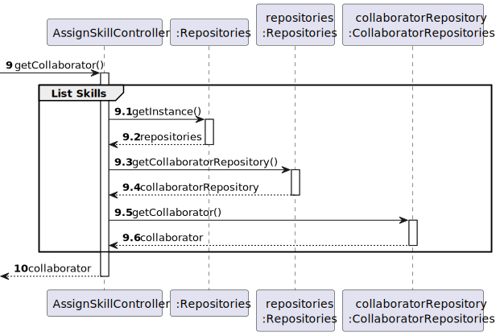
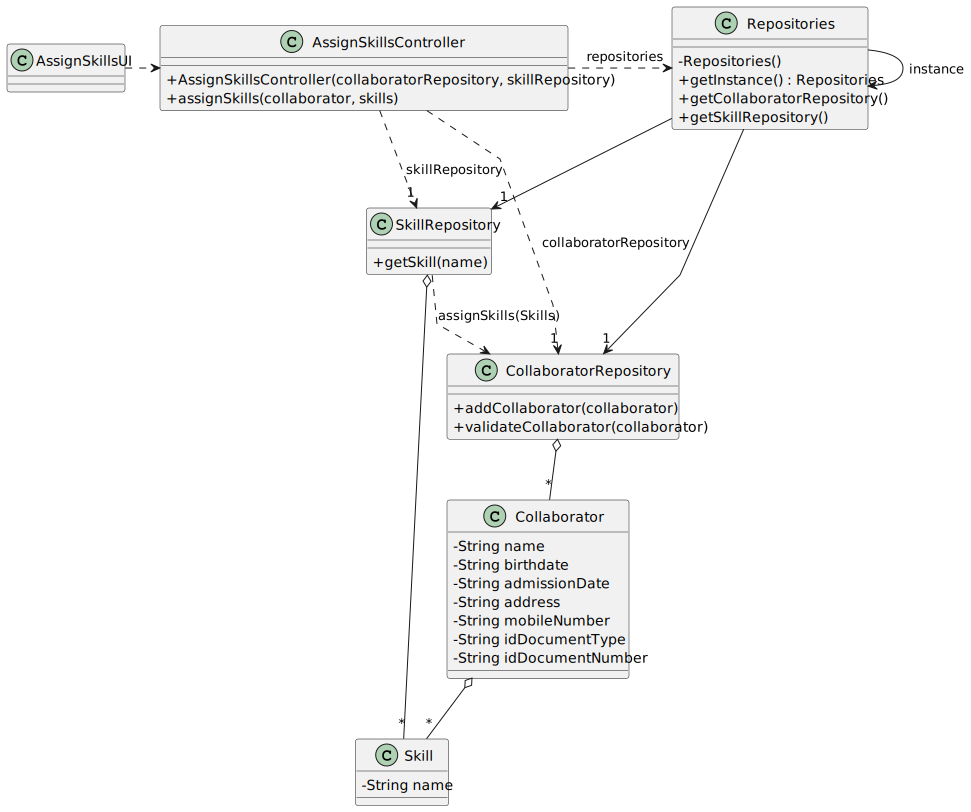

# US004 - Assignment of Skills to a Collaborator

## 3. Design - User Story Realization

### 3.1. Rationale

_**Note that SSD - Alternative One is adopted.**_

| Interaction ID | Question: Which class is responsible for... | Answer                  | Justification (with patterns)                                                                                                                              |
|:---------------|:--------------------------------------------|:------------------------|:-----------------------------------------------------------------------------------------------------------------------------------------------------------|
| Step 1         | ... interacting with the actor?             | AssignSkillsUI          | Pure Fabrication: there is no reason to assign this responsibility to any existing class in the Domain Model.                                              |
|                | ... coordinating the US?                    | AssignSkillsController  | Controller: coordinates the interactions related to assigning skills in the user interface (UI) and executes the logic needed to process these requests. |
|                | ... instantiating a new Skill Assignment?   | Organization            | Creator (Rule 1): in the DM Organization has a Skill Assignment.                                                                                           |
|                | ... knowing the collaborator being assigned skills?  | Collaborator       | IE: Collaborator is the target of the skill assignment.                                                                                                     |
|                | ... knowing the available skills?            | SkillsRepository        | IE: holds the repository of all available skills.                                                                                                           |
| Step 2         | ... saving the assigned skills data?         | Skill Assignment        | IE: object created in step 1 holds the data related to the assigned skills.                                                                                  |
| Step 3         | ... validating all data (local validation)? | Skill Assignment        | IE: owns its data.                                                                                                                                         |
|                | ... validate all data (global validation)?  | Organization            | IE: knows all its Skill Assignments.                                                                                                                        |
|                | ... saving the created skill assignment?     | Organization            | IE: owns all its Skill Assignments.                                                                                                                         |
| Step 4         | ... informing operation success?            | AssignSkillsUI          | IE: is responsible for user interactions.                                                                                                                   |
                                              |

### Systematization ##

According to the taken rationale, the conceptual classes promoted to software classes are:

* Organization
* Skill Assignment

Other software classes (i.e. Pure Fabrication) identified:

* AssignSkillsUI
* AssignSkillsController

## 3.2. Sequence Diagram (SD)

_**Note that SSD - Alternative Two is adopted.**_

### Full Diagram

This diagram shows the full sequence of interactions between the classes involved in the realization of this user story.

### Split Diagrams

The following diagram shows the same sequence of interactions between the classes involved in the realization of this user story, but it is split into partial diagrams to better illustrate the interactions between the classes.

It uses Interaction Occurrence (a.k.a. Interaction Use).

**Get Collaborator Object**

**Assign Skills**

## 3.3. Class Diagram (CD)

