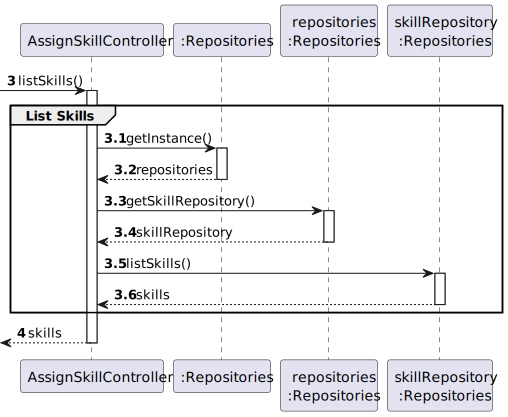

# US004 - Assignment of Skills to a Collaborator

## 3. Design - User Story Realization

### 3.1. Rationale

_**Note that SSD - Alternative One is adopted.**_

| Interaction ID | Question: Which class is responsible for...           | Answer                 | Justification (with patterns)                                                                                                                                               |
|:---------------|:------------------------------------------------------|:-----------------------|:----------------------------------------------------------------------------------------------------------------------------------------------------------------------------|
| Step 1         | ... interacting with the actor?                       | AssignSkillUI          | Pure Fabrication: there is no reason to assign this responsibility to any existing class in the Domain Model.                                                               |
|                | ... coordinating the US?                              | AssignSkillController  | Controller: coordinates the interactions related to assigning a skill to a collaborator in the user interface (UI) and executes the logic needed to process these requests. |
| Step 2         | ... knowing the list of skills to present?            | System                 | IE: Skills are recorded by HRM.                                                                                                                                             |
| Step 3         | ... saving the inputted data?                         | Collaborator           | IE: processes user input and generates a team based on this information.                                                                                                    |
| Step 4         | ... saving the select skills?                         | Collaborator           | IE: AssignSkill manages the selected skills data.                                                                                                                           |
| Step 5         |                                                       |                        |                                                                                                                                                                             |
| Step 6         |                                                       |                        |                                                                                                                                                                             |
| Step 7         | ... validating all data (local validation)?           | Collaborator           | IE: owns its data.                                                                                                                                                          |
|                | ... validating all data (global validation)?          | CollaboratorRepository | IE: knows all its collaborators.                                                                                                                                            |
|                | ... getting the collaborator?                         | CollaboratorRepository | IE: owns all its collaborators.                                                                                                                                             |
| Step 8         |                                                       |                        |                                                                                                                                                                             |
| Step 9         | ... assigning a new skill?                            | CollaboratorRepository | Creator (Rule 2): the CollaboratorRepository assigns skills to the collaborator instance.                                                                                   |
|                | ... validating all data (local validation)?           | Collaborator           | IE: owns its data.                                                                                                                                                          |
|                | ... validating all data (global validation)?          | CollaboratorRepository | IE: knows all its collaborators.                                                                                                                                            |
|                | ... saving the new skills assigned to a collaborator? | CollaboratorRepository | IE: owns all its collaborators.                                                                                                                                             |
| Step 10        | ... informing operation success?                      | AssignSkillUI          | IE: is responsible for user interactions.                                                                                                                                   |

### Systematization ##

According to the taken rationale, the conceptual classes promoted to software classes are:

* CollaboratorRepository
* Collaborator

Other software classes (i.e. Pure Fabrication) identified:

* AssignSkillUI
* AssignSkillController

## 3.2. Sequence Diagram (SD)

_**Note that SSD - Alternative Two is adopted.**_

### Full Diagram

This diagram shows the full sequence of interactions between the classes involved in the realization of this user story.

### Split Diagrams

The following diagram shows the same sequence of interactions between the classes involved in the realization of this user story, but it is split into partial diagrams to better illustrate the interactions between the classes.

It uses Interaction Occurrence (a.k.a. Interaction Use).

**List Skills**

)

**Get Collaborator**

**Assign Skills**

## 3.3. Class Diagram (CD)

