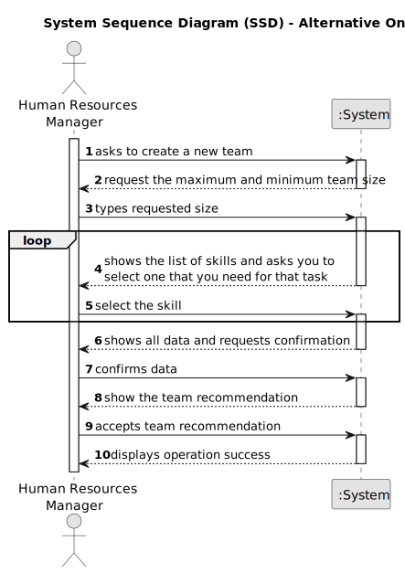

# US005 - Generate a Team Proposal 

## 1. Requirements Engineering

### 1.1. User Story Description

As an HRM, I want to generate a team proposal automatically.

### 1.2. Customer Specifications and Clarifications 

**From the client clarifications:**

> **Question:** How does it generate the team if there are not enough employees?
>
> **Answer:** The system should provide information why it can't generate a team.

> **Question:** How does he purpose a team, for what purpose? (Is there any default)?
>
> **Answer:** There is no purpose, at least in this sprint.

> **Question:** What are the input data to automatically generate a team?
>
> **Answer:** The max size of the team (for instance, 4); The skill needed: Four tree pruner and one light vehicle driver (meaning that one team member has two skills).

> **Question:** Is it necessary for the user to enter the minimum number of members required for a team?
> 
> **Answer:** Yes.

> **Question:** I would also like to know if a collaborator can be in more than one team at the same time?
> 
> **Answer:** No.

> **Question:** Are the skills(input) typed or selected? Does the output show the team members with or without their skills?
>
> **Answer:** The ux/ui is up to the dev team.

> **Question:** What business rules apply to the input data to generate a team proposal?
> 
> **Answer:** Max and Min team size, and a list of skills needed.
For instance:
min: 3
max: 4

> **Question:** Can the team's maxSize be smaller than the number of Skills that are chosen?
>
> **Answer:** maxSize is the maximum number of team members and can be smaller than the number of skills required.
 
> **Question:** Can a collaborator have a Status? Like Activate and Not Activate? Can't they be in more than two teams? If so, is that what the Status is for?
>
> **Answer:** I don't know what a Status is, is it mentioned anywhere in the statement?
A collaborator cannot be in more than one team. 

> **Question:** If, hypothetically, we have defined the minSize and maxSize of the team as 3 and 5 respectively and by checking how many employees have the respective skills we come to the conclusion that we have 6 employees with the necessary skills, how are we supposed to know if we need to generate a team with 3, 4 or 5 elements and which element to leave out?
> 
> **Answer:** Some keywords that can help:
Criteria (e.g. minimizing the number of elements)
Sorting (according to the chosen criteria)
Algorithms (presenting proposals and interacting with the human resources manager)

### 1.3. Acceptance Criteria

* **AC1:** The max and minimum team size and the set of skills must be supplied by the HRM, like in the following example: 
**_4; 3; <tree pruner; tree pruner; tree pruner; light vehicle licence>_**

### 1.4. Found out Dependencies

* There is a dependency on **"US003 - Register a Collaborator"** since it needs information about the employees, such as experience and skills. This allows the system to select the appropriate employees to form the team.
* There is a dependency on **"Assign one or more Skills to a Collaborator"** since skills need to be assigned to employees in the system. The system will have to take the relevant competences into account when forming teams.

### 1.5 Input and Output Data

**Input Data:**

* Typed data:
    * a maximum team size
    * a minimum team size
	
* Selected data:
    * the necessary skills

**Output Data:**

* (In)Success of the operation
* A team recommendation

### 1.6. System Sequence Diagram (SSD)

**_Other alternatives might exist._**

#### Alternative One

### 1.7 Other Relevant Remarks

* The HRM can change the team's recommendation and will be notified if none of the members have the necessary skills to carry out the task.