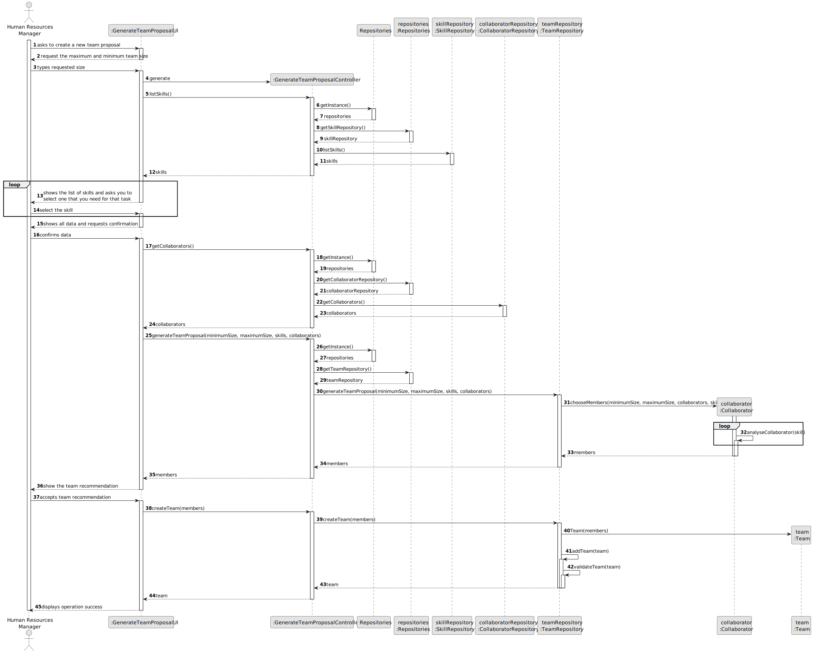
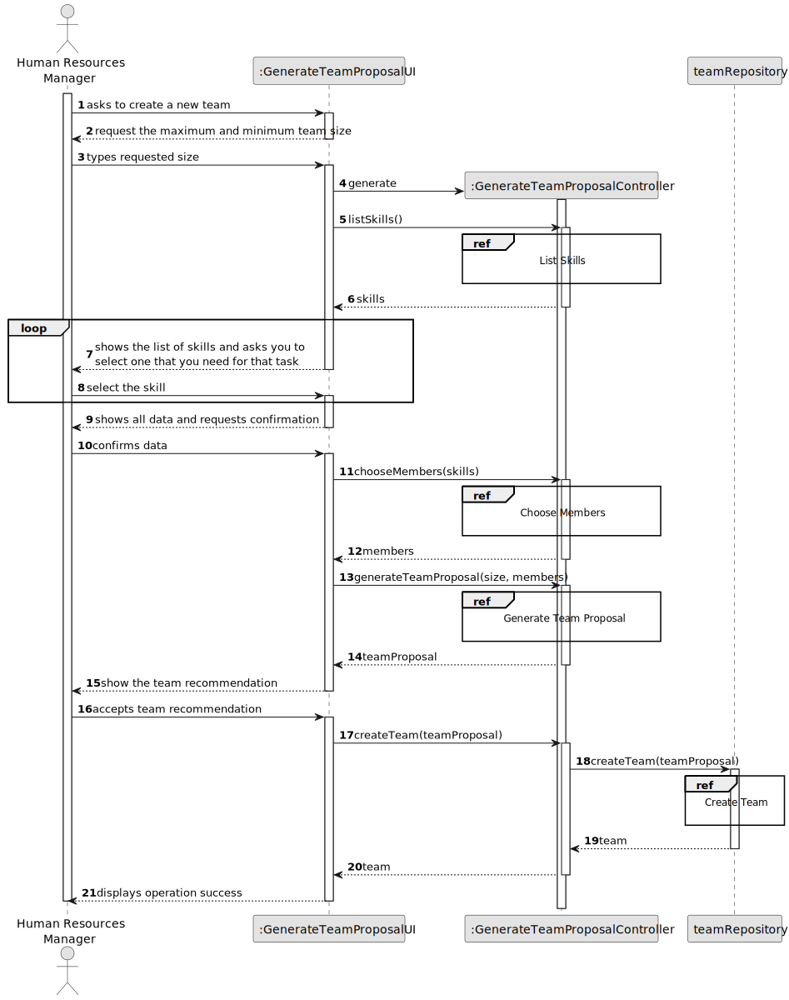
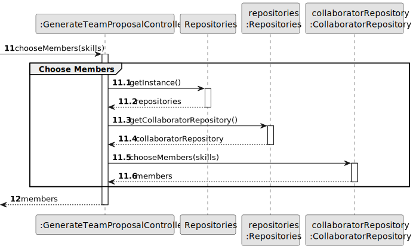
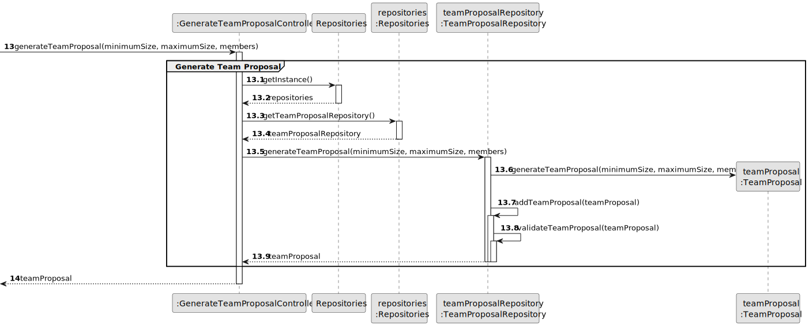
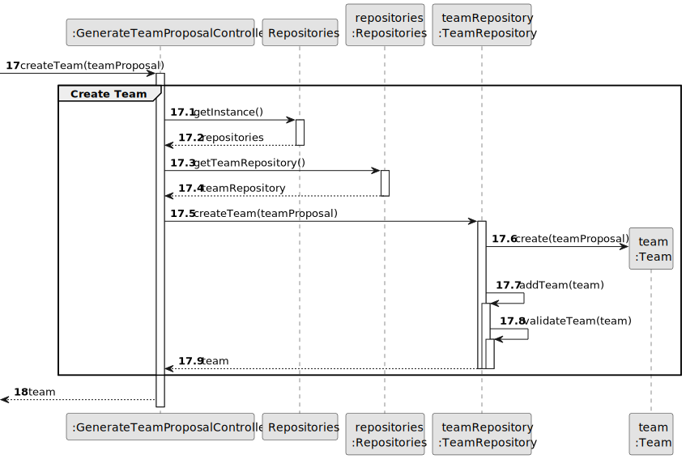
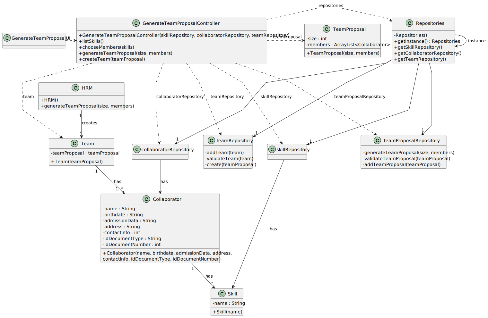

# US005 - Generate a Team Proposal 

## 3. Design - User Story Realization 

### 3.1. Rationale

_**Note that SSD - Alternative One is adopted.**_

| Interaction ID | Question: Which class is responsible for...    | Answer                         | Justification (with patterns)                                                                                                                                      |
|:---------------|:-----------------------------------------------|:-------------------------------|:-------------------------------------------------------------------------------------------------------------------------------------------------------------------|
| Step 1         | ... interacting with the actor?                | GenerateTeamProposalUI         | Pure Fabrication: there is no reason to assign this responsibility to any existing class in the Domain Model.                                                      |
|                | ... coordinating the US?                       | GenerateTeamProposalController | Controller: coordinates the interactions related to generating a team proposal in the user interface (UI) and executes the logic needed to process these requests. |
|                | ... instantiating a new team?                  | TeamRepository                 | Creator (Rule 2): the Organisation registers a Job instance.                                                                                                       |
| Step 2         | ... saving the inputted data?                  | Team                           | IE: processes user input and generates a team proposal based on this information.                                                                                  |
| Step 3         | ... listing available skills for selection?    | GenerateTeamProposalController | Controller: The Controller manages the logic for listing the available competences, coordinating between the UI and the Repositories.                              |
|                | ... choosing members based on selected skills? | GenerateTeamProposalController | Controller: The Controller handles the logic of selecting team members based on the chosen skills and other criteria.                                              |
| Step 4         | ... generating the actual team proposal?       | GenerateTeamProposalController | Controller: The Controller is responsible for generating the team proposal based on the selected members and team size.                                            |
|                |                                                |                                |                                                                                                                                                                    |
|                |                                                |                                |                                                                                                                                                                    |
|                |                                                |                                |                                                                                                                                                                    |
|                |                                                |                                |                                                                                                                                                                    |
|                |                                                |                                |                                                                                                                                                                    |
| Step 2  		     | 							                                        |                                |                                                                                                                                                                    |
| Step 3  		     | 	...saving the inputted data?                  | Task                           | IE: object created in step 1 has its own data.                                                                                                                     |
| Step 4  		     | 	...knowing the task categories to show?       | System                         | IE: Task Categories are defined by the Administrators.                                                                                                             |
| Step 5  		     | 	... saving the selected category?             | Task                           | IE: object created in step 1 is classified in one Category.                                                                                                        |
| Step 6  		     | 							                                        |                                |                                                                                                                                                                    |              
| Step 7  		     | 	... validating all data (local validation)?   | Task                           | IE: owns its data.                                                                                                                                                 | 
| 			  		        | 	... validating all data (global validation)?  | Organization                   | IE: knows all its tasks.                                                                                                                                           | 
| 			  		        | 	... saving the created task?                  | Organization                   | IE: owns all its tasks.                                                                                                                                            | 
| Step 8  		     | 	... informing operation success?              | CreateTaskUI                   | IE: is responsible for user interactions.                                                                                                                          | 

### Systematization ##

According to the taken rationale, the conceptual classes promoted to software classes are: 

* Organization
* Task

Other software classes (i.e. Pure Fabrication) identified: 

* CreateTaskUI  
* CreateTaskController

## 3.2. Sequence Diagram (SD)

_**Note that SSD - Alternative Two is adopted.**_

### Full Diagram

This diagram shows the full sequence of interactions between the classes involved in the realization of this user story.

### Split Diagrams

The following diagram shows the same sequence of interactions between the classes involved in the realization of this user story, but it is split in partial diagrams to better illustrate the interactions between the classes.

It uses Interaction Occurrence (a.k.a. Interaction Use).

**List Skills**

**Choose Team Members**

**Generate Team Proposal**

**Create Team**

## 3.3. Class Diagram (CD)

