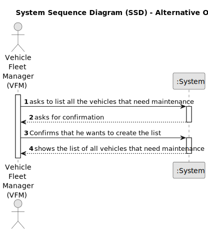

# US008 - List Vehicles that need Maintenance 

## 1. Requirements Engineering

### 1.1. User Story Description

As an FM, I want to list the vehicles needing the check-up.

### 1.2. Customer Specifications and Clarifications 

**From the client clarifications:**

> **Question:** Can the vehicles get placed automatically on a list or the one listing has to be the FM?
>
> **Answer:** The list of vehicles is automatically created but the creation is triggered by the FM.

> **Question:** What information will appear on the final list regarding the vehicle, besides the needing for check-up?
>
> **Answer:** Data that allow to identify the vehicle like Plate, brand and module, as well as the data that allowed to select/insert the vehicle in the list, number of kms, frequency of checkup and the last checkup.

> **Question:** In this US we should only list the vehicles that need a check-up (surpass the check-up frequency in KM) or that will shortly need a check-up (5% to the check-up frequency *already said in another post*), correct? If so, the information about the checkup frequency for each vehicle should be asked in US07?
> 
> **Answer:** No; the Maintenance/Check-up Frequency (in km) is registered in US06.

> **Question:** What are the requests/ input data to list the vehicles needing the check-up? 
> 
> **Answer:** The list must contain all vehicles that have already exceeded the number of km required for the inspection or those that are close to it.
>
> For example:
> 
> a vehicle that made the checkup at 23500 and has a checkup frequency of 10000km.
> 
> a) If it currently has 33600 (exceeded) or
> 
> b) 33480 (there is a difference minor than 5% of the number of kms of the checkup frequency).

> **Question:** Type of vehicle, Current Km and Maintenance/Check-up Frequency (in Kms) are sufficient?
> 
> **Answer:** Current Km and Maintenance/Check-up Frequency (in Kms) are sufficient, yes;

> **Question:** Are there acceptance criteria when asking for the list?
> 
> **Answer:** The list must clearly identify the vehicles through: plate number, brand, model and the that justified the checkup need.

> **Question:** "The list must clearly identify the vehicles through: plate number, brand, model and the [?] that justified the checkup need."
> 
> Did you mean the reason for the check-up need?
> 
> **Answer:** [?] DATA
> 
> current kms, frequency, last checkup kms, next checkup (optimal) kms

### 1.3. Acceptance Criteria

* **AC1:** There must be at least one vehicle that is listed to do a check-up.
* **AC2:** The list must clearly identify the vehicles through: plate number, brand, model and the that justified the checkup need.

### 1.4. Found out Dependencies

* There is a dependency on "US007 - Register a vehicle's check-up" as there must be at least one vehicle registered to being in need of a check-up.

### 1.5 Input and Output Data

**Input Data:**

* Typed data:
    * Some mention of a confirmation to create the list
	
* Selected data:
    * Vehicles that need a check-up. 

**Output Data:**

* List of cars to the check-up
* (In)Success of the operation

### 1.6. System Sequence Diagram (SSD)

#### Alternative One

