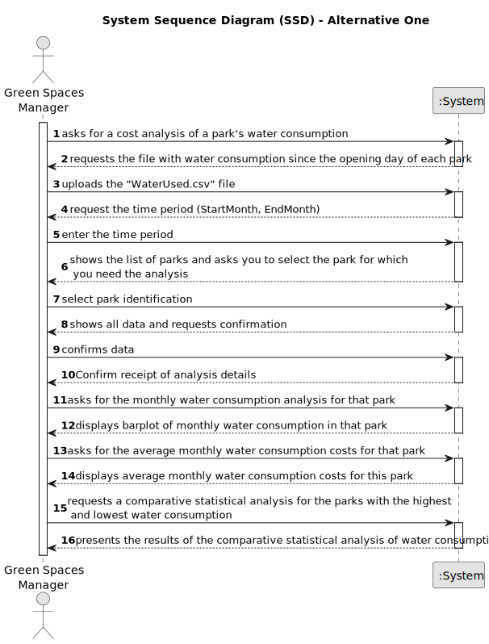

# US009 - Costs of water consumption 

## 1. Requirements Engineering

### 1.1. User Story Description

As a GSM, I want to know the exact costs referring to water consumption of specific green space so that I may manage these expenses efficiently.

### 1.2. Customer Specifications and Clarifications 

**From the specification document:**

> Within this US, the aim is to carry out a statistical analysis concerning the water consumption costs in all parks.

> The "WaterUsed.csv" file provides the necessary data to carry out the study. This file's recorded daily water consumption (in m3) since the day each park opened. The amount paid for water is 0.7 €/m3, up to consumption of 50 m3, with a fee of 15% added for higher consumption levels.

> The data file contains records of the following information: “Park Identification”, “Year”, “Month”, “Day”, “Consumption”.

>  Results to be obtained:
> 
> * Barplot represents monthly water consumption, as a result of the following specifications given by the user: time period (StartMonth, EndMonth) and park identification.
>
> * Average of monthly costs related to water consumption for each park, as a result of the following specifications given by the user: number of parks to be analyzed, and park identification.
>
> * Consider the water consumption of every day that is recorded. The aim is to analyze and compare statistical indicators between the park with the highest and lowest (not null) water consumption. For these two parks, perform the following tasks and compare results:
>   
>   * Calculate the mean, median, standard deviation, and the coefficient of skewness;
>
>   * Build relative and absolute frequency tables (classified data), considering 5 classes;
>
>   * For each park, check if the data has outliers, using the outlier definition as values that deviate from the median by more than 1.5 times the interquartile range;
>
>   * Graphically represents data through histograms with 10 and 100 classes.

**From the client clarifications:**

> **Question:** Is the 15 per cent tax when consumption exceeds 50 m^3 applied to the entire volume of water or only to the volume that has been exceeded?
>
> **Answer:** The volume exceeded.

> **Question:** Is the consumption limit of 50m^3 calculated per day or per month?
>
> **Answer:** Per month.

> **Question:** Regarding the third "task", the park with the highest and the lowest water consumption, does it refer to the total consumption (sum of the consumptions for each park or simply from a day that is recorded)?
>
> **Answer:** You're going to choose two parks. The one that had a day with higher consumption than all those recorded (from all parks) and another park that had a day with lower consumption than all those recorded (from all parks).

> **Question:** Also, to calculate the mean, median, standard deviation and coefficient of skewness, is it from the daily data (days that are recorded)?
> 
> **Answer:** The calculations are made for all the records of the selected parks.

> **Question:** How will the average monthly water consumption costs be displayed? Will the value be saved in a specific file or simply displayed to the user?
> 
> **Answer:** It will be presented to the user/client.

> **Question:** What information do you want displayed on the histograms?
>
> **Answer:** As the statement indicates, all water consumption is recorded for the two selected parks.

> **Question:** What do you mean by "classified data" when it comes to constructing relative and absolute frequency tables?
> 
> **Answer:** As for the classified data, you'll find the answer in the slides in Chapter 2.

> **Question:** When the user enters the park identification, should this be by name or through an ID?
> 
> **Answer:** Name.

> **Question:** On creating the barplot, what's the reason behind asking for the time period (StartMonth, EndMonth) since the barplot is a monthly based graph? Wouldn't it make more sense just to have the name of the desired month instead?
>
> **Answer:** The barplot shows one bar for each month requested. For example, I may only be interested in knowing the consumption in the summer months.

> **Question:** When comparing the park with the highest and lowest water consumption, is it possible that the day of the highest value is not the same as the day of the lowest value? (In this case we will be comparing two parks' data from two different days, am I right?)
>
> **Answer:** You will choose two parks. The one that had a day (it doesn't matter which day) with higher consumption than all those registered (from all the parks) and another park that had a day with lower consumption than all those registered (from all the parks).

> **Question:** What happens if the days with the highest and lowest consumption are associated with the same car park?
> 
> **Answer:** Present the analysis just for this park.

> **Question:** The file "WaterUsed.csv" should be given by the user?
> 
> **Answer:** Yes, the .csv file will be available in the next few days.

> **Question:** When the user enters the park identification, should this be by name or through an ID?
> 
> **Answer:** Users will answer the survey but anonymously.

> **Question:** Will we do the calculations for each of the parks identified by the day with the highest and lowest consumption, or will we add the values for the two parks and do the calculations together?
> 
> **Answer:** The calculations are made for each park separately.

> **Question:** Is the documentation they request for each of US in Portuguese or English?
> 
> **Answer:** Portuguese.

> **Question:** What happens if there are several parks with equally high water consumption and equally low?
Do we choose two at our discretion? Or do we study all the parks in question?
> 
> **Answer:** They do the study for all the parks.

>**Question:** Should we output all the information to a file or show it on the screen and offer that option to the user?
> 
> **Answer:** The output should be displayed.

> **Question:** And the histograms of all the parks too, right?
> 
> **Answer:** Right.

> **Question:** When it comes to creating the Barplot with the monthly water consumption of the selected park, do the start and end months belong to the same year or can the year change? Example: start month 12 2023 and go to month 3 2024.
> 
> **Answer:** They belong to the same year.

### 1.3. Acceptance Criteria

* **AC1:** The programming language must be **Python**.
* **AC2:** The development environment must be **Jupyter Notebook**.
* **AC3:** The format for submitting the work must be a single **Jupyter Notebook file** containing all the work carried out.
* **AC4:** This US must consist of **(1) an introduction (succinct and objective)**; **(2) code and results**, and **(3) analysis and interpretation of the results**.
* **AC5:** Formulas must be written in **LaTeX**.
* **AC6:** At the end of the dossier, **the contribution (in %)** of each member of the group to the development of the work must be indicated (the sum of all percentages must be 100 per cent).

### 1.4. Found out Dependencies

* There are no dependencies in other US.

### 1.5 Input and Output Data

**Input Data:**

* Typed data:
  * "WaterUsed.csv" file
  * time period (StartMonth, EndMonth)
  * number of parks to be analysed
	
* Selected data:
  * park identification

**Output Data:**

* Barplot representing monthly water consumption
* Average of monthly costs related to water consumption
* Statistical analysis comparing the park with the highest and lowest water consumption

### 1.6. System Sequence Diagram (SSD)

**_Other alternatives might exist._**

#### Alternative One

### 1.7 Other Relevant Remarks

