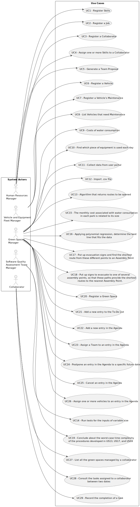

# Use Case Diagram (UCD)

**In the scope of this project, there is a direct relationship of _1 to 1_ between Use Cases (UC) and User Stories (US).**

However, be aware, this is a pedagogical simplification. On further projects and course units there may also exist _1 to N **and/or** N to 1_ relationships between UC and US.

**Insert below the Use Case Diagram in a SVG format**

# Use Cases / User Stories

| UC/US | Description                                                             |                   
|:------|:------------------------------------------------------------------------|
| US001 | [Register Skills](../../us001/Readme.md)                                |
| US002 | [Register a Job](../../us002/Readme.md)                                 |
| US003 | [Register a Collaborator](../../us003/Readme.md)                        |
| US004 | [Assign one or more Skills to a Collaborator](../../us004/Readme.md)    |
| US005 | [Generate a Team Proposal](../../us005/Readme.md)                       |
| US006 | [Register a Vehicle](../../us006/Readme.md)                             |
| US007 | [Register a Vehicle’s Maintenance](../../us007/Readme.md)               |
| US008 | [List Vehicles that need Maintenance](../../us008/Readme.md)            |
| US009 | [Costs of water consumption](../../us009/Readme.md)                     |
| US010 | [Find which piece of equipment is used each day](../../us010/Readme.md) |
| US011 | [Collect data from user portal](../../us011/Readme.md)                  |
| US012 | [Import .csv file](../../us012/Readme.md)                               |
| US013 | [Algorithm that returns routes to be opened](../../us013/Readme.md)     |
| US014 | [Run tests for the inputs of variable size](../../us014/Readme.md)      |
