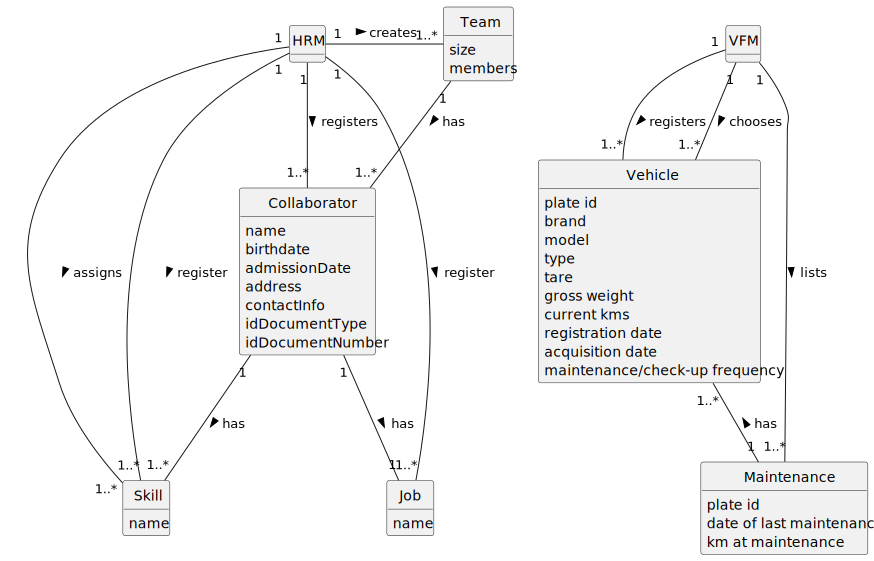

# Green Space Management Application User Manual

## Glossary

To access the glossary, click [here](01.requirements-engineering/glossary.md).

## Introduction

This document as the purpose to explain the app being developed with the idea of showing his purposes and objectives,
and give instructions on how to use it. 
In this manual, it is possible to find the system structure along with the system overview, 
the main features of the product, a structure diagram and features of the app. 
This manual is addressed to the users of the product, specifically the green spaces managers and administrators. 

## System Overview

The main goal of the system developed under this project is to offer an integrated solution for the effective 
management of green spaces for collective use, such as gardens and parks, to be used by town and parish councils.
This application is designed to optimize operations related to the maintenance and planning of these spaces, facilitating 
the management of multidisciplinary teams, the allocation of resources, the control of fleets and equipment, the 
optimization of irrigation and lighting systems, and the production of statistical indicators that make it possible to 
assess the performance of the activities carried out.

### System Structure

The structure of the application is organized around several main modules that interact with each other to offer 
cohesive and integrated management of green spaces:

1. **Collaborator Management**: This module is responsible for registering and managing collaborators, including their 
competences, functions, and assignment to teams. It allows the Human Resources Manager (HRM) to create and manage
collaborators' profiles, record their skills and associate them with specific tasks.

2. **Team Management**: Facilitates the creation and management of multidisciplinary teams, allowing the HRM to compose 
teams based on the skills required to carry out the tasks in the various green spaces.

3. **Vehicle and Equipment Management**: This module allows the Vehicle and Equipment Fleet Manager (FM) to register 
and control vehicles and equipment, ensuring their proper maintenance and availability for scheduled tasks.

4. **Task Management**: This module allows the Green Space Manager (GSM) to create and manage tasks, assign them to
teams, and monitor their execution. It also allows the GSM to postpone, cancel, and assign tasks to one or more vehicles.
And add them to an agenda.

4. **Management of consumption level**: This module allows the Green Space Manager (GSM) to get information about the
consumption levels of a green space as well as the amount to be paid, and multiple comparison involving median and
other statistical information. 

5. **Management of equipment used**: This module allows the Green Space Manager (GSM) to get information about the 
equipment used in each day by retrieving a pie chart of the usage rate of equipment.

7. **Data from user portal**: This module allows the Green Space Manager (GSM) to get information about the
age, if he recommends the park and times he visits the park during the month. 

8. **Lowest cost Spanning tree**: This module allows the Green Space Manager (GSM) to ask the system to make a 
spanning tree of the lowest cost possible, in the creation of an irrigation system.

9. **Shortest route to the closest Meeting Point**: This module allows the Green Space Manager (GSM) to ask the system
to find the shortest route from one point to the closest Meeting Point, for installing signs in case of an emergency.

9. **Asymptotic behavior of the creation of spanning trees** This module allows the Software Quality Assessment Team Manager (QAM)
to get a graph of the asymptotic behavior, being it a graph of the quantity of edges to the time taken to run the function.

### Main Features

- Flexible Resource Management: The application provides flexible management of collaborators, teams, vehicles, and 
equipment, adapting to the dynamic needs of green space management.
- Flexible Task Management: The application allows the management of tasks, on the level of multiple green spaces, by having an agenda with the tasks assigned to multiple teams.
And each task can be postponed, canceled, and assigned to one or more vehicles.
- Efficient work organization: The application allows each collaborator to check the tasks assigned to him between two dates, and record the completion of a task.
- Flexible Statistical Information: The application provides flexible statistical information, for the Green Space Manager, being them the following:
    - Costs of water consumption: The application provides a graph of the water consumption in each park in function of the time of the year 
    - Enables a comparison between two parks in terms of water consumption.
    - Gives a median of the monthly cost of the chosen park.
    - View the percentage of each piece of equipment used each day: The application provides the percentage of usage of each piece of equipment in a pie chart.
    - Collect data from user portal: The application provides the age, if he recommends the park and the  times he visits to the park during the month.
- Irrigation System Creator: The application provides the lowest cost possible irrigation system creator, by making a spanning tree of the lowest cost possible
- Evacuation System: The application provides the shortest route from on point to the closest Meeting Point, by checking the shortest route from different points.
- Behavior Graphical Study: The application provides behavior graphical system to the already mention irrigation system creator
feature, by making an asymptotic graph of the time taken to create one spanning tree representing the irrigation system.

### Structural Diagram

This diagram illustrates the modular organization of the application so far and the key interactions between the 
different components of the system, offering a clear view of its structure and integrated operation.

## Features
> ### 1. Register skills | HRM
> **Purpose:** To enable the Human Resources Manager (HRM) to create a skill or set of skills to later be added to a Collaborator/Employee.
>
> **Instructions**:
> - Log in to your Human Resources Manager account;
> - Navigate to the section where you can add skills;
> - Write the skill or set of skills to be added;
> - Click on "Add skill" or a similar option to automatically add the skill to the program, after you confirm it.

> ### 2. Register a Profession | HRM
> **Purpose:** To enable the Human Resources Manager (HRM) to create a skill or set of skills to later be added to a Collaborator/Employee.
>
> **Instructions**:
> - Log in to your Human Resources Manager account;
> - Navigate to the section where you can assign a job to a collaborator;
> - Write the job to be added, and the name of the person who will do that job;
> - Click on "Add Job" or a similar option to automatically add the job to the employee, after you confirm it.

> ### 3. Registration of an employee | HRM
> **Purpose:** To facilitate the Human Resources Manager (HRM) in the process of registering new employees in the system, ensuring that all necessary personal and professional information is accurately captured.
> 
> **Instructions**:
> - Log in to your Human Resources Manager account;
> - Navigate to the "Employee Management" or a similar section;
> - Choose the option to register a new employee;
> - Enter the required employee details, such as name, birth date, admission date, address, contact info (phone number and email), taxpayer number, ID document type, and ID document number;
> - Review the entered information for accuracy;
> - Click on "Register Employee" or a similar option to complete the registration process, after confirming the accuracy of the information provided.

> ### 4. Assigning skills to an employee | HRM
> **Purpose:** This feature is designed to enable the Human Resources Manager (HRM) to assign specific skills to employees, thereby facilitating better job-role alignment and enhancing the organization's talent management process.
> 
> **Instructions**:
> - Log in to your Human Resources Manager account;
> - Navigate to the "Skill Management" or a similar section;
> - Select the employee to whom you wish to assign skills;
> - Search or browse through the list of available skills;
> - Select one or more skills that match the employee's qualifications and job requirements;
> - Click on "Assign Skills" or a similar option to finalize the assignment of selected skills to the employee, after you confirm the selection.

> ### 5. Generate a Team Proposal | HRM
> **Purpose:** To enable the Human Resources Manager (HRM) to automatically generate a team proposal based on the 
minimum and maximum size of the team and the set of skills required for a given task.
> 
> **Instructions**:
> - Log in to your Human Resources Manager account;
> - Navigate to the section where you can create a team;
> - Enter the desired minimum and maximum team size;
> - Select the necessary skills from the available list (skills already registered by an HRM);
> - Click on "Generate Team" or a similar option to automatically create a team proposal based on the criteria specified.

> ### 6. Register a vehicle | VFM
> **Purpose:** To enable the Vehicle Fleet Manager (VFM) to register a new vehicle.
> 
> **Instructions:**
> - Log in to your Vehicle Fleet Manager account;
> - Navigate to the section where you can register a new vehicle;
> - Write the attributes of the vehicle;
> - Click on "Register vehicle" or a similar option to add the vehicle, after you confirm.

> ### 7. Register a vehicle's maintenance | VFM
> **Purpose:** This feature enables the Vehicle Fleet Manager (VFM) to systematically record and manage the check-up details of vehicles within the organization's fleet, ensuring timely maintenance and service for optimal performance and safety.
> 
> **Instructions:** 
> - Log in to your Vehicle Fleet Manager account;
> - Navigate to the "Vehicle Maintenance" or a similar section;
> - Select the option to register a check-up for a vehicle;
> - Choose the vehicle from the fleet list that requires a check-up;
> - Enter the details of the check-up, including the date, service provider, type of service performed, and any notes on repairs or maintenance issues identified during the check-up;
> - Review the entered information for accuracy;
> - Click on "Register Check-up" or a similar option to record the check-up details for the selected vehicle, after confirming the accuracy of the information provided.

> ### 8. List vehicles that need maintenance | VFM
> **Purpose:** To enable the Vehicle Fleet Manager (VFM) to automatically generate a list of all vehicles that need a check-up.
> 
> **Instructions**:
> - Log in to your Vehicle Fleet Manager account;
> - Navigate to the section where you can list all vehicles that need a check-up;
> - Click on "Generate list" or a similar option to automatically create a list of all vehicles that need a check-up, after you confirm it.

> ### 9. Costs of water consumption | GSM
> **Purpose:** This feature allows the Green Spaces Manager to analyse the costs associated with water consumption in specific parks, facilitating the efficient management of water resources.
> While also providing a comparison between two different parks, showing the median, the average, the standard deviation, the maximum and the minimum of the water consumption costs, and also showing a frequency table
> of the values for a determined daily consumption in percentage and in numerical values.
>
> **Instructions**:
> - From the main menu, select "Water Consumption Cost Analysis".
> - Choose the park you want to analyse from the available list or compare two parks. 
> - Select the time period (month/year) for which you want to visualize the data. 
> - Click on "Visualize" to obtain the results of the analysis.

> ### 10. Find which piece of equipment is used each day | GSM
> **Purpose:** To enable the Green Spaces Manager (GSM) to analyze which pieces of equipment are most frequently used by park visitors each day, helping to inform maintenance schedules and future park enhancements.
>
> **Instructions**:
> - Log in to your Green Spaces Manager account;
> - Navigate to the section where you can analyze equipment usage;
> - Load the data from the "EquipmentUsed.csv" file to review user inputs;
> - Click on "Generate chart" or a similar option to create a pie chart displaying the usage percentage for each piece of equipment, such as walking paths, children’s playground, picnic areas, and exercise machines;
> - Use the insights gained from the chart to make informed decisions about equipment maintenance and upgrades.

> ### 11. Collect data from user portal | GSM
> **Purpose:** To enable the Vehicle Fleet Manager (VFM) to automatically generate a list of all vehicles that need a check-up.
>
> **Instructions**:
> - Log in to your Vehicle Fleet Manager account;
> - Navigate to the section where you can list all vehicles that need a check-up;
> - Click on "Generate list" or a similar option to automatically create a list of all vehicles that need a check-up, after you confirm it.

> ### 12. Import .csv file | GSM
> **Purpose:**  To enable the Green Spaces Manager (GSM) to import route data between different water points from a .csv file into the system. This data will assist in planning and costing the installation of pipes between water points based on distance or other cost parameters.
>
> **Instructions**:
> - Log in to your Green Spaces Manager account;
> - Navigate to the section for "Water Supply Management" or a similar section;
> - Choose the option to import route data;
> - Select the .csv file containing lines with "Water Point X, Water Point Y, Distance" from your device;
> - Click on "Import" or a similar option to upload the file and integrate the data into the application’s unique data structure;
> - Review the imported routes to ensure accuracy and completeness of the data;
> - Use the imported data to plan efficient and cost-effective pipe installations across the surveyed green areas

> ### 13. Algorithm that returns routes to be opened | GSM
> **Purpose:** This feature allows the Green Spaces Manager to apply an algorithm that returns the routes to be opened and pipes needed to be laid with a minimum accumulated cost, ensuring that all points are adequately supplied.
> 
> **Instructions**:
> - Log in to your Green Spaces Manager account;
> - From the main menu, select "Topographic Survey" or a similar option.
> - Choose the park you want to create a Topographic Survey from the available list.
> - Click on "Visualize" to obtain the Topographic Survey

> ### 14. Run tests for the inputs of variable size | QAM
> **Purpose:** This feature allows the Software Quality Assessment Team Manager to run tests for inputs of variable size, to observe the asymptotic behavior of the execution time of the US13 algorithm.
>
> **Instructions**:
> - Log in to your Software Quality Assessment Team Manager account;
> - From the main menu, select "Asymptotic Behavior" or a similar option.
> - Run the algorithm of US13 for all the files that you want.
> - Click on "Visualize" to obtain the Asymptotic Behavior graph.

> ### 15. The monthly cost associated with water consumption in each park is related to its size | GSM
> **Purpose:** To enable the Human Resources Manager (HRM) to create a skill or set of skills to later be added to a Collaborator/Employee.
>
> **Instructions**:
> - Log in to your Human Resources Manager account;
> - Navigate to the section where you can add skills;
> - Write the skill or set of skills to be added;
> - Click on "Add skill" or a similar option to automatically add the skill to the program, after you confirm it.

> ### 16. Applying polynomial regression, determine the best line that fits the data | GSM
> **Purpose:** To enable the Human Resources Manager (HRM) to create a skill or set of skills to later be added to a Collaborator/Employee.
>
> **Instructions**:
> - Log in to your Human Resources Manager account;
> - Navigate to the section where you can assign a job to a collaborator;
> - Write the job to be added, and the name of the person who will do that job;
> - Click on "Add Job" or a similar option to automatically add the job to the employee, after you confirm it.

> ### 17. Put up evacuation signs and find the shortest route from these different points to an Assembly Point | GSM
> **Purpose:** To facilitate the Human Resources Manager (HRM) in the process of registering new employees in the system, ensuring that all necessary personal and professional information is accurately captured.
>
> **Instructions**:
> - Log in to your Human Resources Manager account;
> - Navigate to the "Employee Management" or a similar section;
> - Choose the option to register a new employee;
> - Enter the required employee details, such as name, birthdate, admission date, address, contact info (phone number and email), taxpayer number, ID document type, and ID document number;
> - Review the entered information for accuracy;
> - Click on "Register Employee" or a similar option to complete the registration process, after confirming the accuracy of the information provided.

> ### 18. Put up signs to evacuate to one of several assembly points, so that these paths provide the shortest routes to the nearest Assembly Point. | GSM
> **Purpose:** This feature is designed to enable the Human Resources Manager (HRM) to assign specific skills to employees, thereby facilitating better job-role alignment and enhancing the organization's talent management process.
>
> **Instructions**:
> - Log in to your Human Resources Manager account;
> - Navigate to the "Skill Management" or a similar section;
> - Select the employee to whom you wish to assign skills;
> - Search or browse through the list of available skills;
> - Select one or more skills that match the employee's qualifications and job requirements;
> - Click on "Assign Skills" or a similar option to finalize the assignment of selected skills to the employee, after you confirm the selection.

> ### 19. Conclude about the worst-case time complexity of the procedures developed in US13, US17 and US18 | QAM
> **Purpose:** To enable the Human Resources Manager (HRM) to automatically generate a team proposal based on the
minimum and maximum size of the team and the set of skills required for a given task.
>
> **Instructions**:
> - Log in to your Human Resources Manager account;
> - Navigate to the section where you can create a team;
> - Enter the desired minimum and maximum team size;
> - Select the necessary skills from the available list (skills already registered by an HRM);
> - Click on "Generate Team" or a similar option to automatically create a team proposal based on the criteria specified.

> ### 20. Register a Green Space | GSM
> **Purpose:** To enable the Green Space Manager (GSM) to register a green space, such as a garden, medium-sized park, or large-sized park, along with its respective area.
>
> **Instructions:**
> - Log in to your Green Space Manager account.
> - Navigate to the section dedicated to managing green spaces or parks.
> - Select the option to register a new green space.
> - Provide the necessary details for the green space, including its type (garden, medium-sized park, or large-sized park) and area measurement.
> - After entering the information, click on the "Register" or similar option to save the new green space entry.

> ### 21. Add a new entry to the To-Do List | GSM
> **Purpose:** To enable the Green Space Manager (GSM) to add a new entry to the To-Do List, ensuring that tasks related to the management of green spaces are properly organized and tracked.
> 
> **Instructions:**
> - Log in to your Green Space Manager account.
> - Navigate to the section dedicated to managing the To-Do List.
> - Select the option to add a new entry.
> - Choose the green space from the list of managed spaces.
> - Enter the details of the new entry, such as task description, priority, and due date.
> - Click on the "Add" or similar option to save the new entry to the To-Do List.
 
> ### 22. Add a new entry in the Agenda | GSM
> **Purpose:** To enable the Vehicle Fleet Manager (VFM) to automatically generate a list of all vehicles that need a check-up.
>
> **Instructions**:
> - Log in to your Vehicle Fleet Manager account;
> - Navigate to the section where you can list all vehicles that need a check-up;
> - Click on "Generate list" or a similar option to automatically create a list of all vehicles that need a check-up, after you confirm it.

> ### 23. Assign a Team to an entry in the Agenda | GSM
> **Purpose:** This feature allows the Green Spaces Manager to analyse the costs associated with water consumption in specific parks, facilitating the efficient management of water resources.
>
> **Instructions**:
> - From the main menu, select "Water Consumption Cost Analysis".
> - Choose the park you want to analyse from the available list.
> - Select the time period (month/year) for which you want to visualize the data.
> - Click on "Visualize" to obtain the results of the analysis.

> ### 24. Postpone an entry in the Agenda to a specific future date | GSM
> **Purpose:** To enable the Green Spaces Manager (GSM) to analyze which pieces of equipment are most frequently used by park visitors each day, helping to inform maintenance schedules and future park enhancements.
>
> **Instructions**:
> - Log in to your Green Spaces Manager account;
> - Navigate to the section where you can analyze equipment usage;
> - Load the data from the "EquipmentUsed.csv" file to review user inputs;
> - Click on "Generate chart" or a similar option to create a pie chart displaying the usage percentage for each piece of equipment, such as walking paths, children’s playground, picnic areas, and exercise machines;
> - Use the insights gained from the chart to make informed decisions about equipment maintenance and upgrades.

> ### 25. Cancel an entry in the Agenda | GSM
> **Purpose:** To enable the Vehicle Fleet Manager (VFM) to automatically generate a list of all vehicles that need a check-up.
>
> **Instructions**:
> - Log in to your Vehicle Fleet Manager account;
> - Navigate to the section where you can list all vehicles that need a check-up;
> - Click on "Generate list" or a similar option to automatically create a list of all vehicles that need a check-up, after you confirm it.

> ### 26. Assign one or more vehicles to an entry in the Agenda | GSM
> **Purpose:**  To enable the Green Spaces Manager (GSM) to import route data between different water points from a .csv file into the system. This data will assist in planning and costing the installation of pipes between water points based on distance or other cost parameters.
>
> **Instructions**:
> - Log in to your Green Spaces Manager account;
> - Navigate to the section for "Water Supply Management" or a similar section;
> - Choose the option to import route data;
> - Select the .csv file containing lines with "Water Point X, Water Point Y, Distance" from your device;
> - Click on "Import" or a similar option to upload the file and integrate the data into the application’s unique data structure;
> - Review the imported routes to ensure accuracy and completeness of the data;
> - Use the imported data to plan efficient and cost-effective pipe installations across the surveyed green areas

> ### 27. List all the green spaces managed by a GSM | GSM
> **Purpose:** This feature allows the Green Spaces Manager to apply an algorithm that returns the routes to be opened and pipes needed to be laid with a minimum accumulated cost, ensuring that all points are adequately supplied.
>
> **Instructions**:
> - Log in to your Green Spaces Manager account;
> - From the main menu, select "Topographic Survey" or a similar option.
> - Choose the park you want to create a Topographic Survey from the available list.
> - Click on "Visualize" to obtain the Topographic Survey

> ### 28. Consult the tasks assigned to a collaborator between two dates | Collaborator
> **Purpose:** This feature allows the Software Quality Assessment Team Manager to run tests for inputs of variable size, to observe the asymptotic behavior of the execution time of the US13 algorithm.
>
> **Instructions**:
> - Log in to your Software Quality Assessment Team Manager account;
> - From the main menu, select "Asymptotic Behavior" or a similar option.
> - Run the algorithm of US13 for all the files that you want.
> - Click on "Visualize" to obtain the Asymptotic Behavior graph.

> ### 29. Record the completion of a task | Collaborator
> **Purpose:** To facilitate task management for collaborators by providing a feature to record the completion of tasks, ensuring clear communication and tracking of task progress within the system.
>
> **Instructions**:
> - Log in to your user account.
> - Navigate to the section dedicated to task management or the To-Do List.
> - Select the task that you have completed from the list.
> - Look for an option such as "Mark as Completed" or similar.
> - Click on the option to indicate that the task has been completed.
> - Verify that the system provides confirmation that the task has been successfully marked as completed.