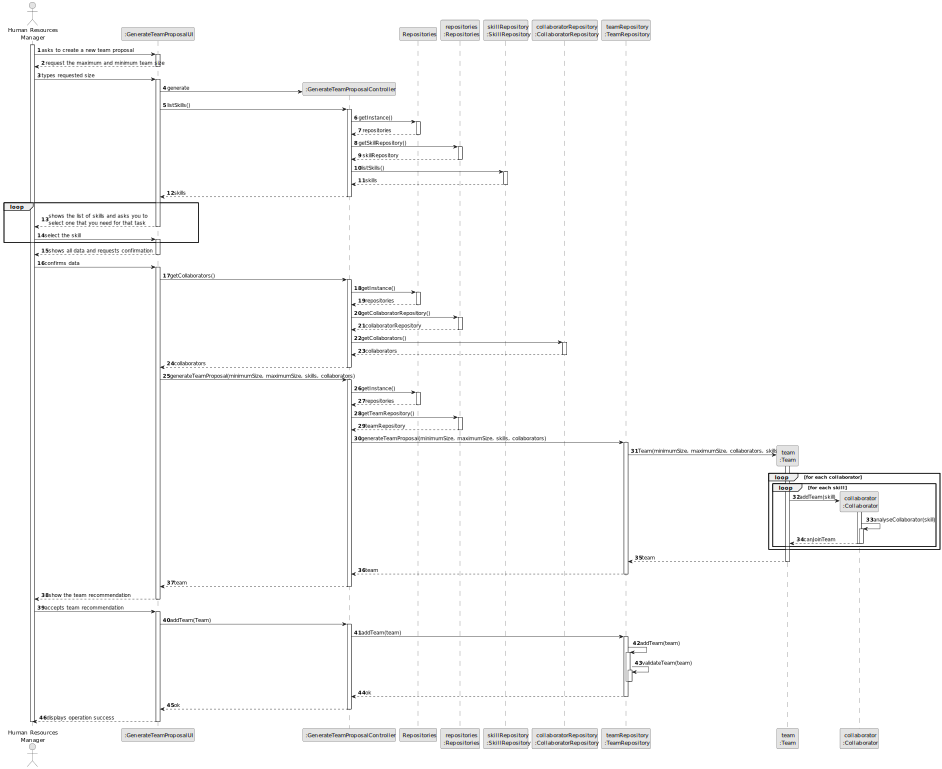
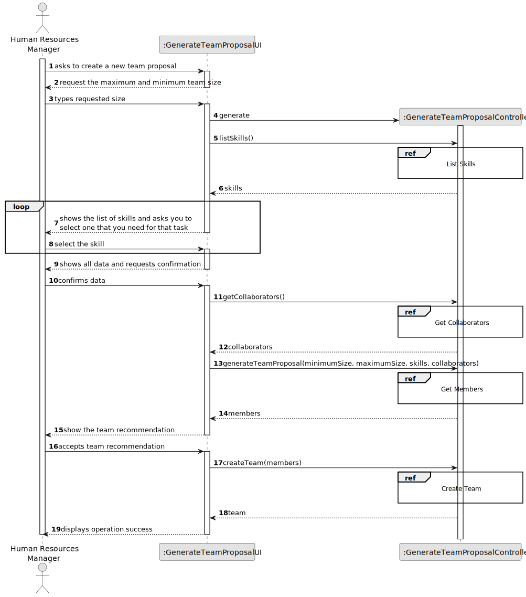
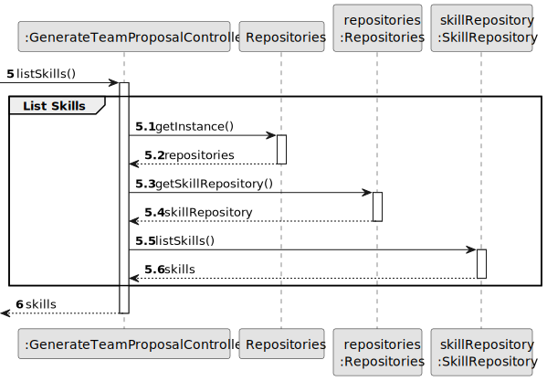
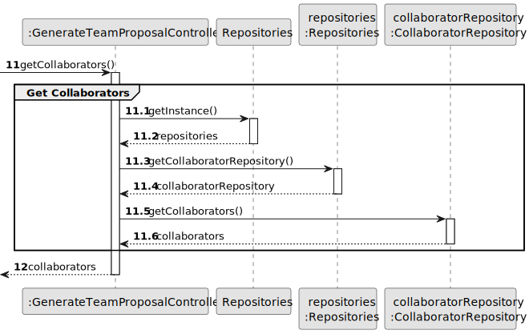
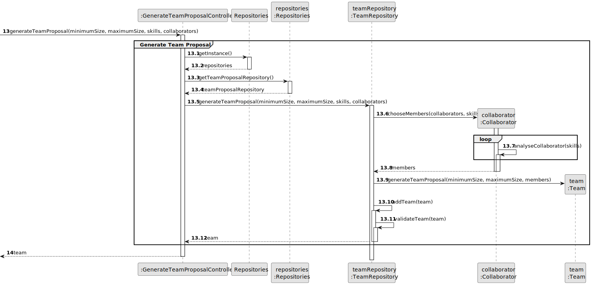
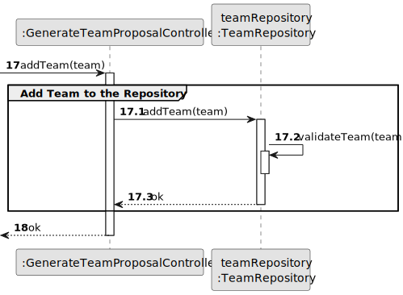
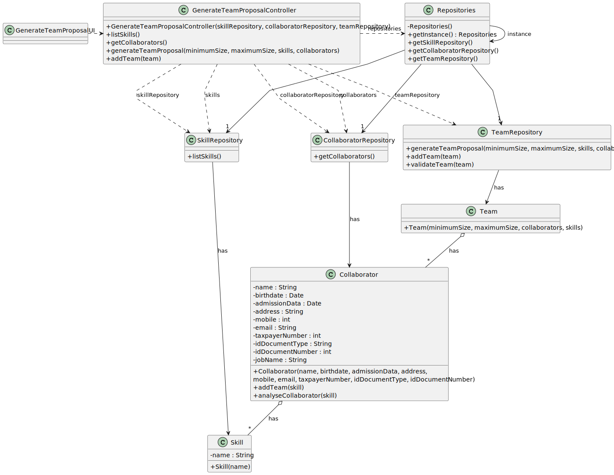

# US005 - Generate a Team Proposal 

## 3. Design - User Story Realization 

### 3.1. Rationale

_**Note that SSD - Alternative One is adopted.**_

| Interaction ID | Question: Which class is responsible for...  | Answer                         | Justification (with patterns)                                                                                                                                      |
|:---------------|:---------------------------------------------|:-------------------------------|:-------------------------------------------------------------------------------------------------------------------------------------------------------------------|
| Step 1         | ... interacting with the actor?              | GenerateTeamProposalUI         | Pure Fabrication: there is no reason to assign this responsibility to any existing class in the Domain Model.                                                      |
| Step 2         |                                              |                                |                                                                                                                                                                    |
| Step 3         | ... coordinating the US?                     | GenerateTeamProposalController | Controller: coordinates the interactions related to generating a team proposal in the user interface (UI) and executes the logic needed to process these requests. |
|                | ... saving the inputted data?                | Team                           | IE: processes user input and generates a team based on this information.                                                                                           |
|                | ... knowing the list of skills to present?   | SkillRepository                | IE: knows all its skills.                                                                                                                                          |
| Step 4         |                                              |                                |                                                                                                                                                                    |
| Step 5         | ... saving the select skills?                | TeamRepository                 | IE: TeamRepository manages the selected skills data.                                                                                                               |
| Step 6         |                                              |                                |                                                                                                                                                                    |
| Step 7         | ... knowing the list of collaborators?       | CollaboratorRepository         | IE: knows all its collaborators.                                                                                                                                   |
|                | ... instantiating a new team?                | TeamRepository                 | Creator (Rule 2): the TeamRepository registers a Team instance.                                                                                                    |
|                | ... choosing collaborators for the team?     | Team                           | IE: The Team class is responsible for choosing collaborators because it has the necessary information about the team's requirements and the selection criteria.    |
|                | ... validating all data (local validation)?  | Team                           | IE: owns its data.                                                                                                                                                 |
| Step 8         |                                              |                                |                                                                                                                                                                    |
| Step 9         | ... validating all data (global validation)? | TeamRepository                 | IE: knows all its teams proposal.                                                                                                                                  |
|                | ... saving the created team?                 | TeamRepository                 | IE: owns all its teams proposal.                                                                                                                                   |
| Step 10        | ... informing operation success?             | GenerateTeamProposalUI         | IE: is responsible for user interactions.                                                                                                                          |

### Systematization ##

According to the taken rationale, the conceptual classes promoted to software classes are: 

* TeamRepository
* Team

Other software classes (i.e. Pure Fabrication) identified: 

* GenerateTeamProposalUI  
* GenerateTeamProposalController

## 3.2. Sequence Diagram (SD)

_**Note that SSD - Alternative Two is adopted.**_

### Full Diagram

This diagram shows the full sequence of interactions between the classes involved in the realization of this user story.

### Split Diagrams

The following diagram shows the same sequence of interactions between the classes involved in the realization of this user story, but it is split in partial diagrams to better illustrate the interactions between the classes.

It uses Interaction Occurrence (a.k.a. Interaction Use).

**List Skills**

**Get Collaborators**

**Generate Team Proposal**

**Add Team to the Repository**

## 3.3. Class Diagram (CD)

