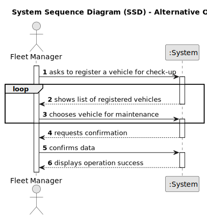

# US007 - Register a Vehicle’s Maintenance

## 1. Requirements Engineering

### 1.1. User Story Description

The VFM wants to register a vehicles maintenance.

### 1.2. Customer Specifications and Clarifications

**From the client clarifications:**

> **Question:** Which attributes are needed for the vehicles maintenance?
> 
> **Answer:** Plate number, date, kms at maintenance.
 
> **Question:** What is the unit of measurement used to estimate the maintenance frequency?
> 
> **Answer:** In the scope of the project only kms will be considered.

### 1.3. Acceptance Criteria

* **AC1:** All required fields must be filled in.
* **AC2:** The chosen vehicle must be a registered vehicle.

### 1.4. Found out Dependencies

* There is a dependency on "US006 - Register a vehicle" as there must be at least one vehicle registered so that it can be inspected.

### 1.5 Input and Output Data

**Input Data:**

* Typed data:
    * Plate number of the vehicle
    * Date 
    * Kms on maintenance

**Output Data:**

* (In)Success of the operation

### 1.6. System Sequence Diagram (SSD)

**_Other alternatives might exist._**

#### Alternative One

