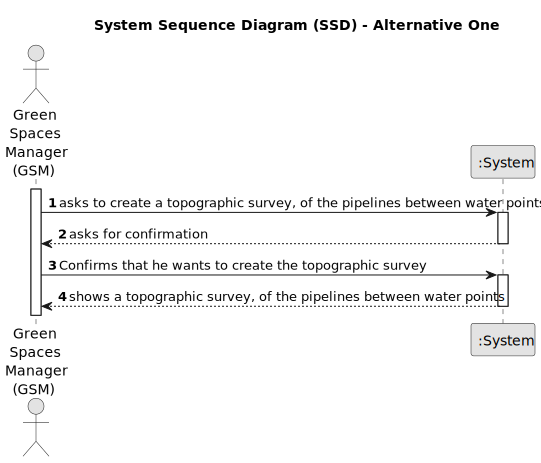

# US013 - Algorithm that returns routes to be opened 

## 1. Requirements Engineering

### 1.1. User Story Description

As a GSM, I want to apply an algorithm that returns the routes
to be opened and pipes needed to be laid with a minimum accumulated
cost, ensuring that all points are adequately supplied.

### 1.2. Customer Specifications and Clarifications 

**From the client clarifications:**

> **Question:** Do the vertices mentioned in the statement have coordinates? For example : (41.1496 , -8.6112) (Latitude, Longitude)
>
> If we're going to be correct, as in the case of the Porto city park example, we have to use coordinates to represent a specific point in the park!
>
> **Answer:** The csv files that we will make available for US13 do not provide the coordinates of the vertices, only the information mentioned in US12.
>
> If we want to faithfully draw the map of the watering points, we do need the coordinates. As computer scientists/mathematicians, to solve the problem in question, this is unnecessary information/noise.

> **Question:** So how will the vertice be identified? Can you give me an example (Letter, Number,...)?
> 
> **Answer:** 3 examples:
(1,2,10)
(a,b,10)
(camelia,33,10)

> **Question:** Should we show the algorithm's execution time?
> 
> **Answer:** It's not required, but they can. Just the execution time of the US13 procedure, which only involves primitive operations.

### 1.3. Acceptance Criteria

* **AC1:** All implemented procedures must only use primitive operations, and not existing functions in JAVA libraries.

### 1.4. Found out Dependencies

* There is a dependency on **US012 - Import .csv file** since it needs information about all possible routes that can be
  opened to lay pipes between each pair of water points, and their respective installation costs. This allows the system to select the pipes needed to be laid with a minimum accumulated
  cost, ensuring that all points are adequately supplied.

### 1.5 Input and Output Data

* Input data:
  * File with all possible routes that can be
      opened to lay pipes between each pair of water points, and their respective installation costs. 
* Selected data:

**Output Data:**

* (In)Success of the operation
*  A topographic survey, of the best and least expensive pipelines between water points 

### 1.6. System Sequence Diagram (SSD)

**_Other alternatives might exist._**

#### Alternative One

### 1.7 Other Relevant Remarks

