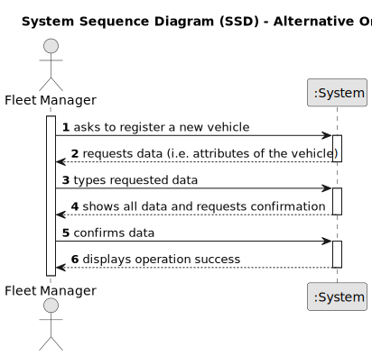

# US020 -Register a green space

## 1. Requirements Engineering

### 1.1. User Story Description

As a Green Space Manager (GSM), I want to register a green
space (garden, medium-sized park or large-sized park) and its respective
area

### 1.2. Customer Specifications and Clarifications 

**From the project statement document:**

> The green space (garden, medium-sized park, or large-sized park) must have an associated name and area.

**From the client clarifications:**

> **Question:** 
> 
> **Answer:** 
 
> **Question:** 
> 
> **Answer:** 

### 1.3. Acceptance Criteria

* **AC1:** The green space must have a unique name.
* **AC2:** The green space must have a defined area entered as a numeric value.
* **AC3:** The type of green space must be selected from a predetermined list (garden, medium-sized park, large-sized park).

### 1.4. Found out Dependencies

* There is a dependency on **US027 - List GreenSpaces**  since the green spaces need to be registered before they can be listed.

### 1.5 Input and Output Data

**Input Data:**

* Typed data:
    * Name of the Green Space
    * Type of Green Space (garden, medium-sized park, large-sized park)
    * Area (in square meters)

**Output Data:**

* (In)Success of the operation
* List of all registered jobs

### 1.6. System Sequence Diagram (SSD)

**_Other alternatives might exist._**

#### Alternative One

