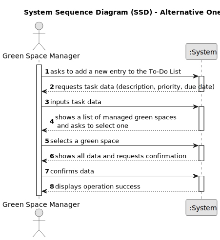

# US021 - Add a New Entry to the To-Do List

## 1. Requirements Engineering

### 1.1. User Story Description

As a GSM, I want to add a new entry to the To-Do List.

### 1.2. Customer Specifications and Clarifications 

> The To-Do List comprises all the tasks required to be done in order to assure the proper functioning of the parks. These tasks can be regular (e.g., pruning trees) or occasional (e.g., repairing a broken piece of equipment). They may also require a multi-disciplinary team, and the length of the task can vary from a few minutes (e.g., replacing a light bulb) to weeks (e.g., installing an irrigation system).
>
> The entries in this list describe the required task, the degree of urgency (High, Medium, and Low), and the approximate expected duration.

**From the client clarifications:**

> **Question:** Are the new entries on the list divided in categories? For example, the statement talks about regular and occasional tasks, should the distinction be made for the user?
> 
> **Answer:** In the scope of the current proof-of-concept, there are no user stories using that categories.

> **Question:** Is it mandatory for the program to have multiple GSM? If so, should each green space be associated with a responsible GSM? In other words, can only the GSM assigned to a specific green space register a new entry for the to-do list?
> 
> **Answer:** The program can have multiple GSM. Yes. Yes.

> **Question:** One task can be associated to more than one green space?
>
> **Answer:** A generic task, yes; like "Prunning Trees" but not a concrete task, like "Prunning Trees" in Parque da Cidade.

> **Question:** Can different tasks have the same title?
>
> **Answer:** A generic task can have the same title but a concrete needs further details. For instance:
Generic Task: "Prunning Trees"
Concrete Task at To-Do List: name(Prunning Trees); park(Arca De Agua); urgency(low); estimated duration(2 working days)

> **Question:** When a to-do list entry is added to the agenda, what should its state be?
>
> **Answer:** Maybe "planned".

> **Question:** What time unit should be used for the duration of the task?
>
> **Answer:** Hour and/or days.

> **Question:** When a new entry is added to the ToDo list, the default status of that task will be "pending" or no status at all is considered on ToDo list?
>
> **Answer:** "Pending" as default for to-do list entries sounds good.

> **Question:** - If there are multiple GSM in the system, can a GSM create an entry for a Green Space managed by another GSM? - Should the to-do entries be unique or can a GSM repeat the same to-do entry, for the same Green Space, multiple times. - If the To-Do entry is assigned to the Agenda, should it be removed for the To-Do entry, if it only occasional? - What are the details the GSM needs to input, other than the Green Space, frequency, estimated duration?Title and description are required? - Should the GSM define the skills needed for a To-Do entry?
>
> **Answer:** No; Yes; Assuming the previous task with same description was previously processed and is not open anymore; Should change the status to processed; Title and description could be useful; no but maybe it should be done for type of task (or similar);

### 1.3. Acceptance Criteria

* **AC1:** The new entry must be associated with a green space managed by the GSM.
* **AC2:** The green space for the new entry should be chosen from a list presented to the GSM.

### 1.4. Found out Dependencies

There is a dependency on **US020 - Register a Green Space and its Respective Area**, since the To-Do List entries must be associated with a green space.

### 1.5 Input and Output Data

**Input Data:**

* Typed data:
  * Task description
  * Degree of urgency (High, Medium, Low)
  * Approximate expected duration
  * The green space associated with the task

**Output Data:**

* (In)Success of the operation

### 1.6. System Sequence Diagram (SSD)

**_Other alternatives might exist._**

#### Alternative One

