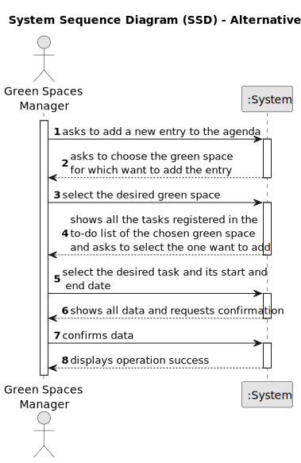

# US022 - Add a new Entry in the Agenda

## 1. Requirements Engineering

### 1.1. User Story Description

As a GSM, I want to add a new entry in the Agenda.

### 1.2. Customer Specifications and Clarifications 

**From the project statement document:**

> The Agenda is made up of entries that relate to a task (which was previously in the To-Do List), the team that will carry out the task, the vehicles/equipment assigned to the task, expected duration, and the status (Planned, Postponed, Canceled, Done).

**From the client clarifications:**

> **Question:** We know that an entry in the diary has a target date, but should this target date be entered when transferring a task from the task list to the diary, or should it be entered when creating the task in the task list?
> 
> **Answer:** To-do list entries doesn't have dates!

> **Question:** When a new entry is added to the Agenda, the status of that task will be, by default, set to "planned", right?
> 
> **Answer:** Sounds good.

> **Question:** What is the definition of an entry?
>
> **Answer:** There are Agenda Entries and To-do List Entries.
A To-Do list is a list of "tasks" one need to do, each "task" one insert in the list is an Entry.
Agenda and its Entries, follow the same logic.

> **Question:** When the GSM plans a task (that was previously in To-Do) into the Agenda, what additional data/information does he need to input when planning?
> 
> **Answer:** The starting date for the task.
Later the GSM will be able to add the Team and vehicles (if required).

> **Question:** Can I add an entry that has a time period that already have an existing entry in the Agenda?
> 
> **Answer:** Yes, because:
a) there are many parks to manage
b) different tasks can be executed at same time in the same park.

> **Question:** Regarding the US022, when we are registering an entry to the agenda, are the three inputs (selecting an existing task from the to-do list, starting date, and finishing date) sufficient?
> 
> **Answer:** The starting date will be enough because the task already has the predicted duration.

> **Question:** When a To-Do List entry is planned and moves to the Agenda, the status change from "Pending" to "Planned". Should this entry be removed from the To-Do List or just change status to "Planned" as it is on the Agenda?
> 
> **Answer:** Changing the status in the To-Do list to Planned seems to be a good approach.

### 1.3. Acceptance Criteria

* **AC1:** The new entry must be associated with a green space managed by the GSM.
* **AC2:** The new entry must exist in the To-Do list.

### 1.4. Found out Dependencies

* There is a dependency on **"US020 - Register a Green Space and its Respective Area"**, since the diary entries must be associated with a green space.
* There is a dependency on **"US021 - Add a New Entry to the To-Do List"**, since new agenda entries must exist on the To-Do List.

### 1.5 Input and Output Data

**Input Data:**

* Selected data:
    * a green space
    * the tasks on the green space to-do list.

* Typed data:
    * the starting date of the task.
    * the finishing date of the task.

**Output Data:**
* (In)Success of the operation

### 1.6. System Sequence Diagram (SSD)

**_Other alternatives might exist._**

#### Alternative One

