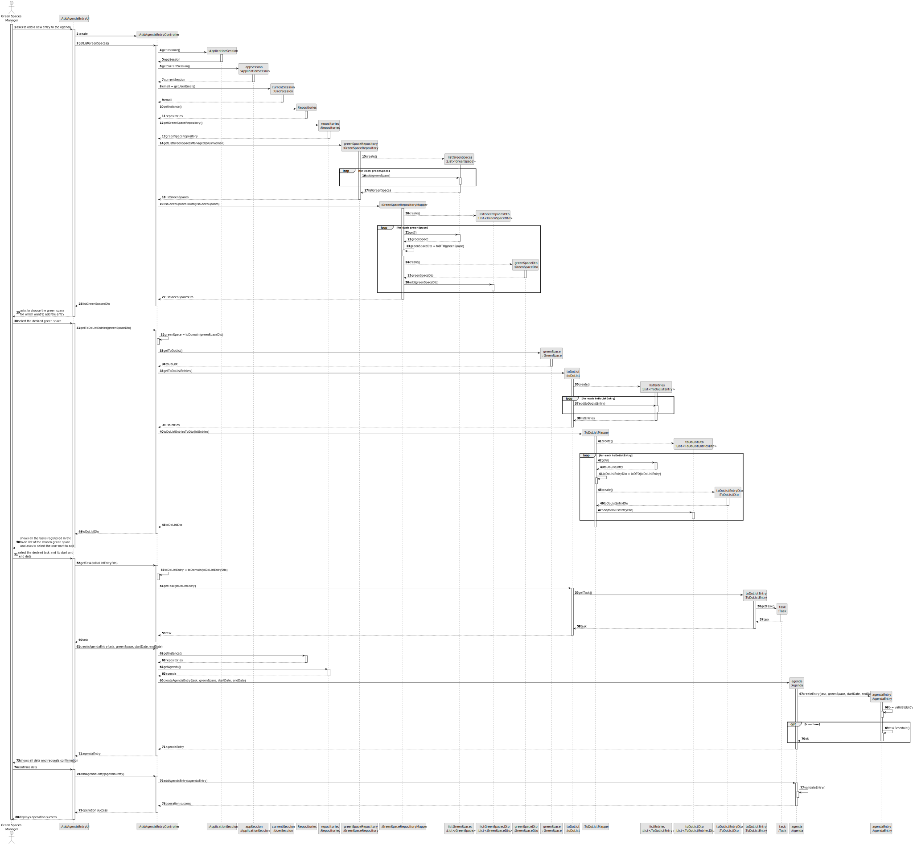
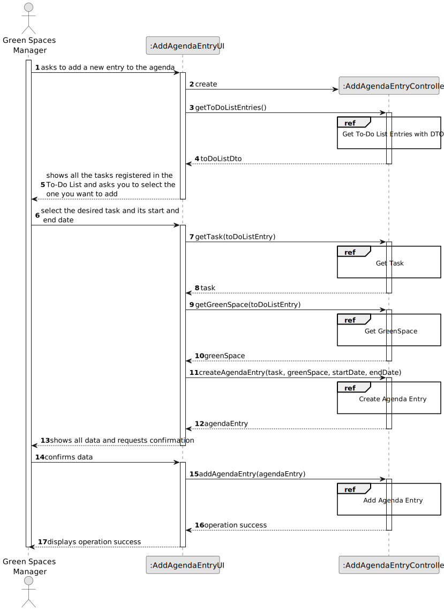
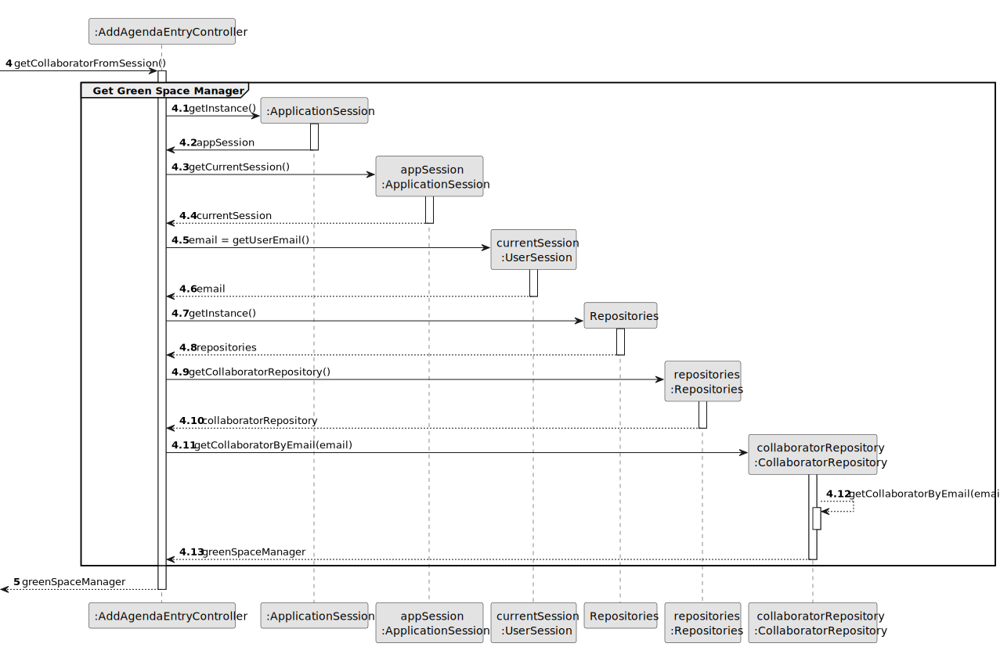
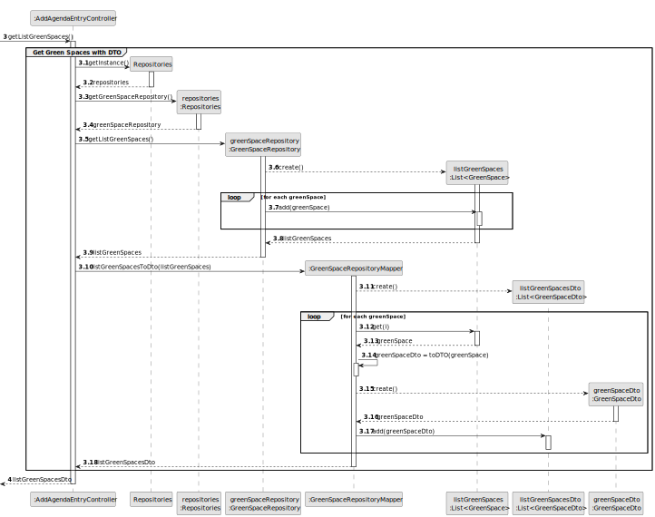
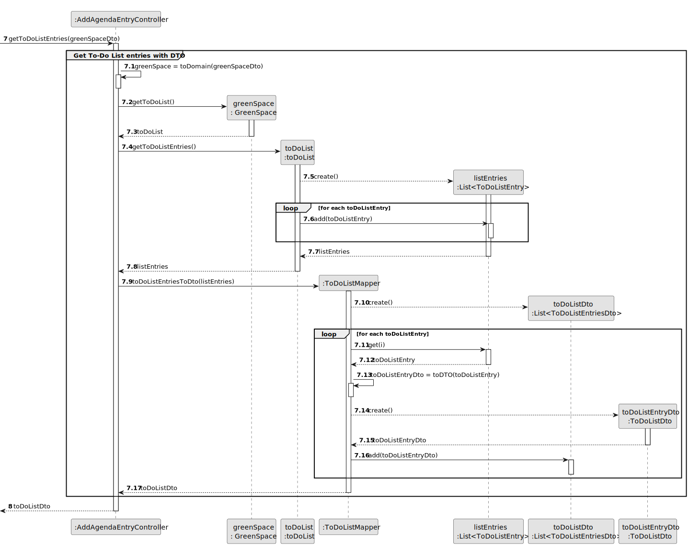
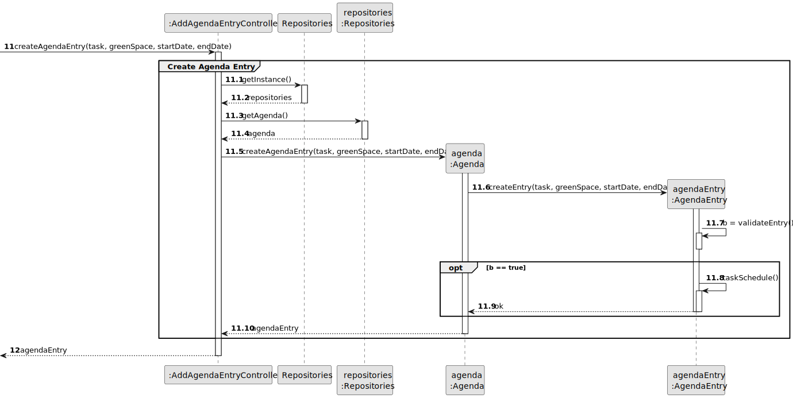
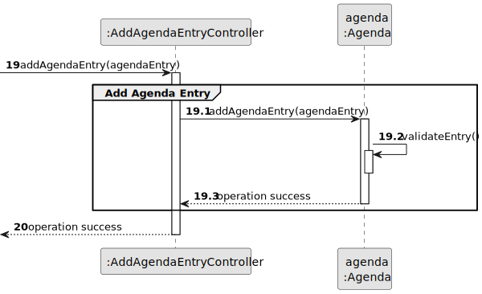
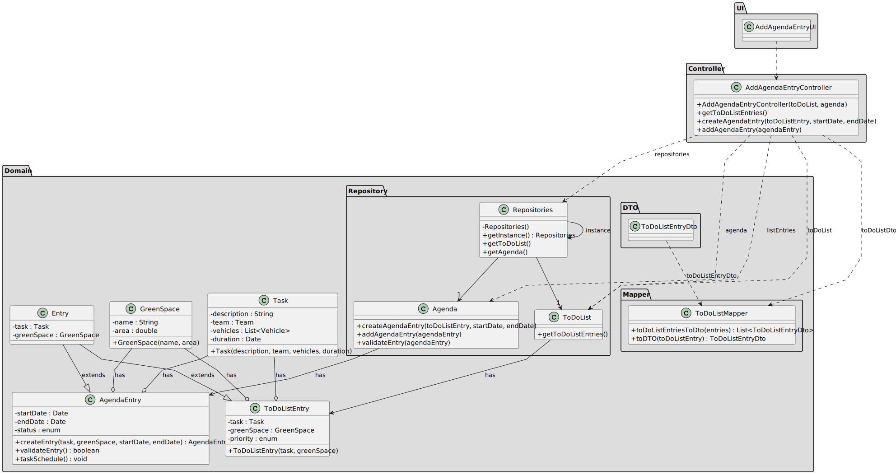

# US022 - Add a new Entry in the Agenda

## 3. Design - User Story Realization 

### 3.1. Rationale

_**Note that SSD - Alternative One is adopted.**_

| Interaction ID | Question: Which class is responsible for...                  | Answer                     | Justification (with patterns)                                                                                                                                                                                                                                               |
|:---------------|:-------------------------------------------------------------|:---------------------------|:----------------------------------------------------------------------------------------------------------------------------------------------------------------------------------------------------------------------------------------------------------------------------|
| Step 1         | ... interacting with the actor?                              | AddAgendaEntryUI           | Pure Fabrication: there is no reason to assign this responsibility to any existing class in the Domain Model.                                                                                                                                                               |
|                | ... coordinating the US?                                     | AddAgendaEntryController   | Controller: coordinates the interactions related to add agenda entry in the user interface (UI) and executes the logic needed to process these requests.                                                                                                                    |
|                | ... knowing the user using the system?                       | UserSession                | IE: The UserSession class is the expert on information about the current user, such as their identity and session-specific data. This adheres to the principle of assigning responsibilities to the class that has the necessary information to fulfill the responsibility. |
|                | ... storing and managing collaborator data?                  | CollaboratorRepository     | IE: CollaboratorRepository knows collaborator details, making it easier to separate concerns and centralise collaborator data management.                                                                                                                                   |
|                | ... knowing the green spaces?                                | GreenSpaceRepository       | IE: knows how to access the data of green spaces.                                                                                                                                                                                                                           |
|                | ... create a list with all the data of greenSpaceRepository? | GreenSpaceRepositoryMapper | Indirection: It introduces an intermediate layer to transform domain entities into DTOs, promoting separation of responsibilities and low coupling.                                                                                                                         |
|                | ... encapsulating the data of a green space into a DTO?      | GreenSpaceDto              | Indirection: Represents green space data in a simplified format for transfer between application layers, promoting separation of concerns.                                                                                                                                  |
|                | ... returning green spaces DTOs to the UI?                   | AddAgendaEntryController   | Controller: coordinates the interaction and data flow between the UI and the model.                                                                                                                                                                                         |
| Step 2         |                                                              |                            |                                                                                                                                                                                                                                                                             |
| Step 3         | ... convert greenSpaceDto into a domain entity?              | AddAgendaEntryController   | Controller: Responsible for mediating the conversion of greenSpaceDto into a domain entity (GreenSpace), centralising the transformation logic and maintaining the separation of responsibilities.                                                                          |
|                | ... knowing the to-do List                                   | GreenSpace                 | IE: know your to-do list.                                                                                                                                                                                                                                                   |
|                | ... knowing the To-Do list Entries?                          | ToDoList                   | IE: knows how to access the data of To-Do list entries.                                                                                                                                                                                                                     |
|                | ... create a list with all the data of toDoList?             | ToDoListMapper             | Indirection: It introduces an intermediate layer to transform domain entities into DTOs, promoting separation of responsibilities and low coupling.                                                                                                                         |
|                | ... encapsulating the data of a to-do list entry into a DTO? | ToDoListDto                | Indirection: Represents to-do list entry data in a simplified format for transfer between application layers, promoting separation of concerns.                                                                                                                             |
|                | ... returning To-Do list entries DTOs to the UI?             | AddAgendaEntryController   | Controller: coordinates the interaction and data flow between the UI and the model.                                                                                                                                                                                         |
| Step 4         |                                                              |                            |                                                                                                                                                                                                                                                                             |
| Step 5         | ... convert toDoListEntryDto into a domain entity?           | AddAgendaEntryController   | Controller: Responsible for mediating the conversion of toDoListEntryDto into a domain entity (ToDoListEntry), centralising the transformation logic and maintaining the separation of responsibilities.                                                                    |
|                | ... knowing the task associated with the To-Do List entry?   | ToDoListEntry              | IE: ToDoListEntry is the most knowledgeable about its associated Task.                                                                                                                                                                                                      |
|                | ... instantiating a new Agenda Entry?                        | Agenda                     | Creator (Rule 2): the Agenda registers a EntryAgenda instance..                                                                                                                                                                                                             |
|                | ... saving the inputted data?                                | AgendaEntry                | IE: processes user input and generates a agenda entry based on that information.                                                                                                                                                                                            |
|                | ... marking the status as scheduled?                         | AgendaEntry                | IE: owns the information necessary to manage its status.                                                                                                                                                                                                                    |
|                | ... validating all data (local validation)?                  | AgendaEntry                | IE: owns its data.                                                                                                                                                                                                                                                          |
| Step 6         |                                                              |                            |                                                                                                                                                                                                                                                                             |
| Step 7         | ... validating all data (global validation)?                 | Agenda                     | IE: knows all its agenda entries.                                                                                                                                                                                                                                           |
|                | ... saving the created agenda entry?                         | Agenda                     | IE: owns all its agenda entries.                                                                                                                                                                                                                                            |
| Step 8         | ... informing operation success?                             | AddAgendaEntryUI           | IE: is responsible for user interactions.                                                                                                                                                                                                                                   |

### Systematization ##

According to the taken rationale, the conceptual classes promoted to software classes are: 

* UserSession
* CollaboratorRepository
* GreenSpaceRepository
* GreenSpaceRepositoryMapper
* GreenSpaceDto
* GreenSpace
* ToDoList
* ToDoListMapper
* ToDoListDto
* ToDoListEntry
* Agenda
* AgendaEntry

Other software classes (i.e. Pure Fabrication) identified: 

* AddAgendaEntryUI
* AddAgendaEntryController

## 3.2. Sequence Diagram (SD)

_**Note that SSD - Alternative Two is adopted.**_

### Full Diagram

This diagram shows the full sequence of interactions between the classes involved in the realization of this user story.

### Split Diagrams

The following diagram shows the same sequence of interactions between the classes involved in the realization of this user story, but it is split in partial diagrams to better illustrate the interactions between the classes.

It uses Interaction Occurrence (a.k.a. Interaction Use).

**Get Green Space Manager**

**Get Green Spaces with DTO**

**Get To-Do List entries with DTO**

**Get Task**

**Create Agenda Entry**

**Add Agenda Entry**

## 3.3. Class Diagram (CD)

