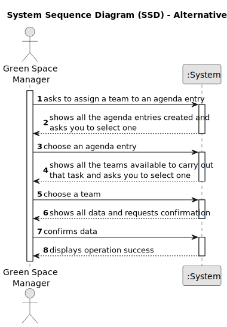

# US023 - Assign a Team to an Entry in the Agenda 

## 1. Requirements Engineering

### 1.1. User Story Description

As a GSM, I want to assign a Team to an entry in the Agenda.

### 1.2. Customer Specifications and Clarifications 

**From the client clarifications:**

> **Question:** Can an Agenda entry have more than one team assigned to it?
> 
> **Answer:** No.

> **Question:** Can a Team be assigned to multiple entries?
>
> **Answer:** Yes.

### 1.3. Acceptance Criteria

* **AC1:** A message must be sent to all team members informing them about the assignment.
* **AC2:** Different email services can send the message. These services must be defined through a configuration file to allow the use of different platforms (e.g. Gmail, DEI’s email service, etc.).

### 1.4. Found out Dependencies

* There is a dependency on **"US022 - Add a new Entry in the Agenda"**, since the teams will be assigned at the Agenda Entry.

### 1.5 Input and Output Data

**Input Data:**

* Selected data:
  * an agenda entry
  * a team

**Output Data:**
* (In)Success of the operation

### 1.6. System Sequence Diagram (SSD)

**_Other alternatives might exist._**

#### Alternative One

