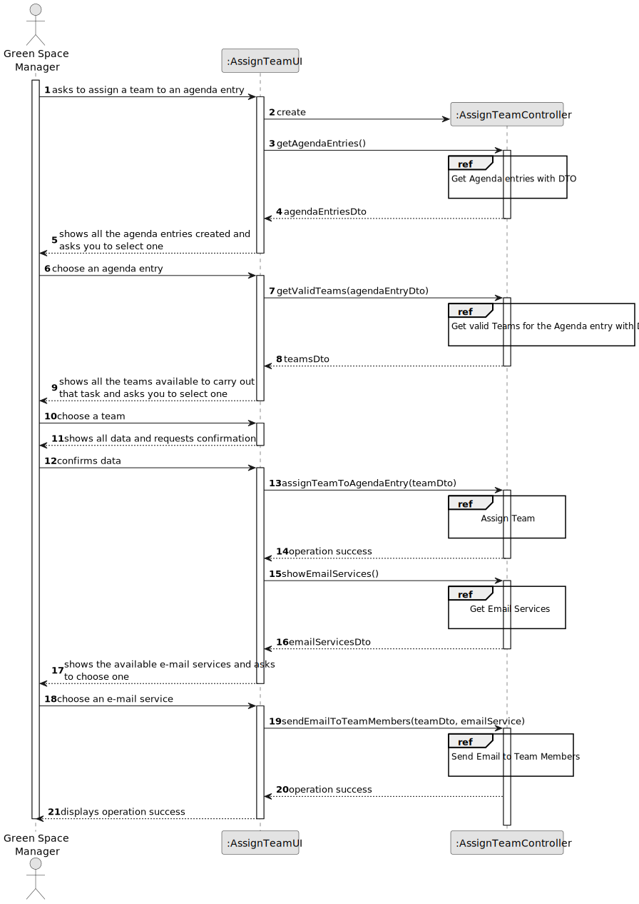
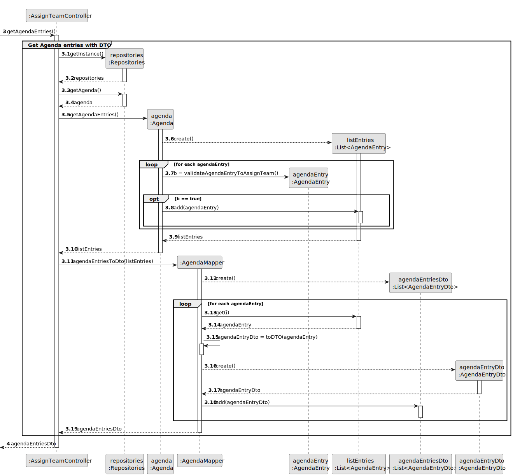
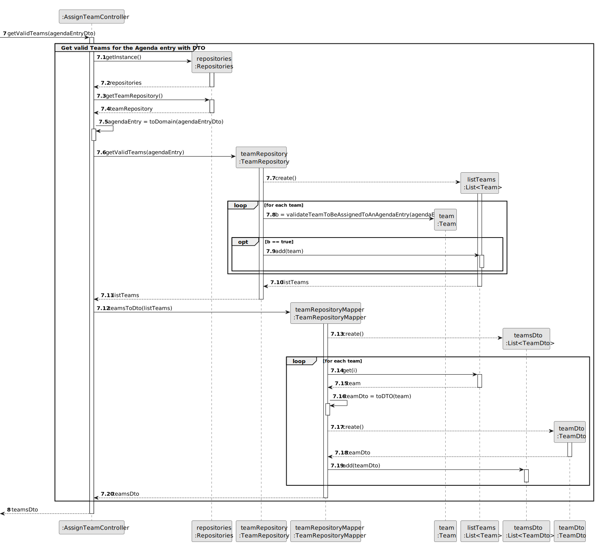
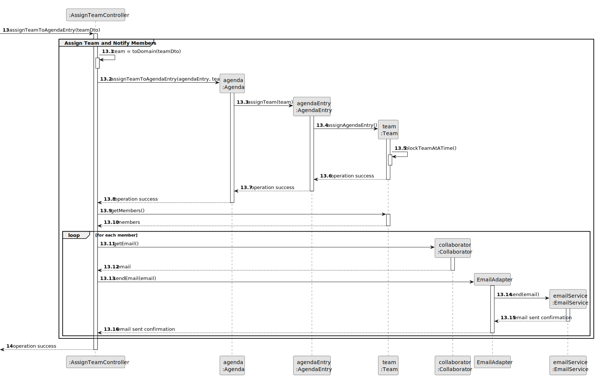
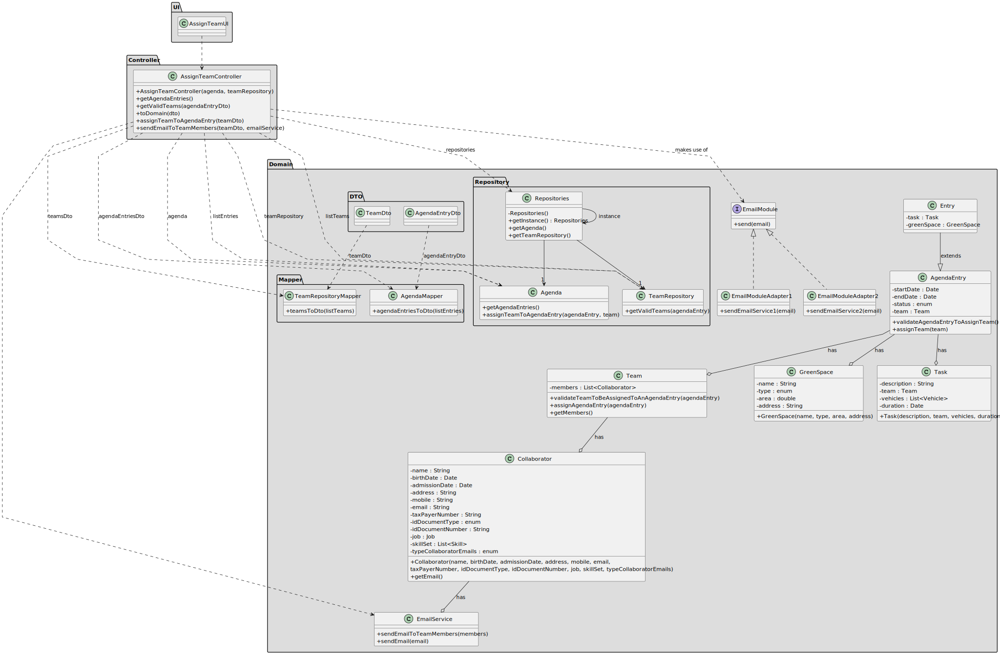

# US023 - Assign a Team to an Entry in the Agenda 

## 3. Design - User Story Realization 

### 3.1. Rationale

_**Note that SSD - Alternative One is adopted.**_

| Interaction ID | Question: Which class is responsible for...                                                      | Answer               | Justification (with patterns)                                                                                                                                                                        |
|:---------------|:-------------------------------------------------------------------------------------------------|:---------------------|:-----------------------------------------------------------------------------------------------------------------------------------------------------------------------------------------------------|
| Step 1         | ... interacting with the actor?                                                                  | AssignTeamUI         | Pure Fabrication: there is no reason to assign this responsibility to any existing class in the Domain Model.                                                                                        |
|                | ... coordinating the US?                                                                         | AssignTeamController | Controller: coordinates the interactions related to assign teams to agenda entry in the user interface (UI) and executes the logic needed to process these requests.                                 |
|                | ... knowing the agenda entries?                                                                  | Agenda               | IE: knows how to access the data of agenda entries.                                                                                                                                                  |
|                | ... create a list with all the data of Agenda?                                                   | AgendaMapper         | Indirection: It introduces an intermediate layer to transform domain entities into DTOs, promoting separation of responsibilities and low coupling.                                                  |
|                | ... by checking which agenda entries can be assigned a team?                                     | AgendaEntry          | IE: owns its data.                                                                                                                                                                                   |
|                | ... encapsulating the data of a agenda into a DTO?                                               | AgendaEntryDto       | Indirection: Represents agenda entry data in a simplified format for transfer between application layers, promoting separation of concerns.                                                          |
|                | ... returning agenda entries DTOs to the UI?                                                     | AssignTeamController | Controller: coordinates the interaction and data flow between the UI and the model.                                                                                                                  |
| Step 2         |                                                                                                  |                      |                                                                                                                                                                                                      |
| Step 3         | ... convert agendaEntryDto into a domain entity?                                                 | AssignTeamController | Controller: Responsible for mediating the conversion of agendaEntryDto into a domain entity (AgendaEntry), centralising the transformation logic and maintaining the separation of responsibilities. |
|                | ... knowing the teams?                                                                           | TeamRepository       | IE: knows how to access the data of teams.                                                                                                                                                           |
|                | ... create a list of all valid TeamRepository data?                                              | TeamRepositoryMapper | Indirection: It introduces an intermediate layer to transform domain entities into DTOs, promoting separation of responsibilities and low coupling.                                                  |
|                | ... to check if the team can be added to the agenda entry?                                       | Team                 | IE: owns its data.                                                                                                                                                                                   |
|                | ... encapsulating the data of a team repository into a DTO?                                      | TeamDto              | Indirection: Represents team data in a simplified format for transfer between application layers, promoting separation of concerns.                                                                  |
|                | ... returning teams DTOs to the UI?                                                              | AssignTeamController | Controller: coordinates the interaction and data flow between the UI and the model.                                                                                                                  |
| Step 4         |                                                                                                  |                      |                                                                                                                                                                                                      |
| Step 5         |                                                                                                  |                      |                                                                                                                                                                                                      |
| Step 6         | ... convert teamDto into a domain entity?                                                        | AssignTeamController | Controller: Responsible for mediating the conversion of teamDto into a domain entity (Team), centralising the transformation logic and maintaining the separation of responsibilities.               |
|                | ... assigning the team?                                                                          | Agenda               | Creator (Rule 2): the Agenda assigns team to the agendaEntry instance.                                                                                                                               |
|                | ... by blocking the possibility of a team being assigned to two agenda entries at the same time? | Team                 | IE: owns its data.                                                                                                                                                                                   |
|                | ... knowing the members?                                                                         | Team                 | IE: owns its data.                                                                                                                                                                                   |
|                | ... knowing the collaborators' email?                                                            | Collaborator         | IE: owns its data.                                                                                                                                                                                   |
|                | ... interacting with external email services?                                                    | EmailModule          | Adapter: Provides a standard interface for interacting with different external email services, allowing for flexibility and decoupling.                                                              |
|                | ... implementing the external email service adapter?                                             | EmailAdapter         | Adapter: These classes implement the EmailModule interface, allowing for different external email services to be used interchangeably.                                                               |
|                | ... sending emails to collaborators?                                                             | EmailService         | Indirection: Provides an intermediary service for sending emails, decoupling the email sending process from the core application logic.                                                              |
|                | ... saving the new time assigned to a agenda entry?                                              | Agenda               | IE: owns all its agenda entries.                                                                                                                                                                     |
| Step 7         | ... informing operation success?                                                                 | AssignTeamUI         | IE: is responsible for user interactions.                                                                                                                                                            |
                                                                                                                          

### Systematization ##

According to the taken rationale, the conceptual classes promoted to software classes are: 

* Agenda
* AgendaMapper
* AgendaEntry
* AgendaEntryDto
* TeamRepository
* TeamRepositoryMapper
* Team
* TeamDto
* Collaborator
* EmailAdapter
* EmailService

Other software classes (i.e. Pure Fabrication) identified: 

* AssignTeamUI  
* AssignTeamController

## 3.2. Sequence Diagram (SD)

_**Note that SSD - Alternative Two is adopted.**_

### Full Diagram

This diagram shows the full sequence of interactions between the classes involved in the realization of this user story.

### Split Diagrams

The following diagram shows the same sequence of interactions between the classes involved in the realization of this user story, but it is split in partial diagrams to better illustrate the interactions between the classes.

It uses Interaction Occurrence (a.k.a. Interaction Use).

**Get Agenda entries with DTO**

**Get valid Teams for the Agenda Entry with DTO**

**Assign Team and Notify Members**

## 3.3. Class Diagram (CD)

