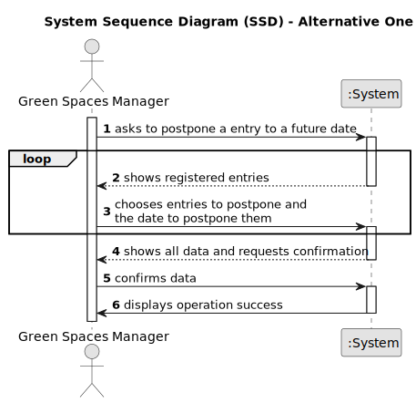

# US024 - Postpone entry in the Agenda 

## 1. Requirements Engineering

### 1.1. User Story Description

The GSM wants to postpone an entry in the Agenda to a specific date in the future.

### 1.2. Customer Specifications and Clarifications 

**From the project statement document:**

>	 

**From the client clarifications:**

> **Question:** What are the input to postpone an entry? From my perspective the Green Spaces Manager only needs to select the entry and introduce the new date.
> 
> **Answer:** Yes, you are correct!
> 
> **Question:** The selected task(s) will be postponed by one interval defined by the user or for the next day??
> 
> **Answer:** When postponing a task, the new predicated date for execution should be inserted.
> 
> **Question:** The date you want to postpone in this US24 is the date referring to the "approximate expected duration" field when we registered the task?
> 
> **Answer:** No; sometimes, for various reasons (e.g. insufficient staff, faulty equipment or adverse weather conditions) a task has to be postponed to a new date; task duration is not directly related to this.

### 1.3. Acceptance Criteria

* **AC1:** 
* **AC2:** 

### 1.4. Found out Dependencies

* One dependence with US022 has there must be an entry to postpone.

### 1.5 Input and Output Data

**Input Data:**

* Typed data:
    * the date to which the entry will be postponed

* Selected data:
    * the entry to postpone.  

**Output Data:**

* (In)Success of the operation

### 1.6. System Sequence Diagram (SSD)

**_Other alternatives might exist._**

#### Alternative One

