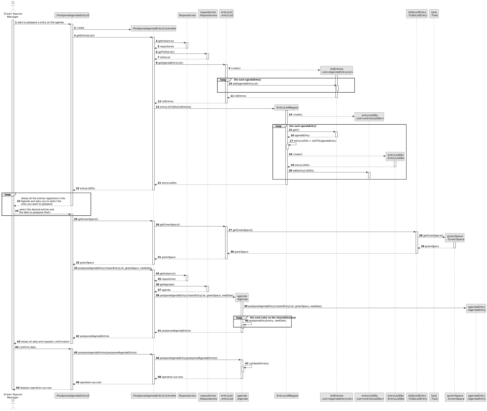
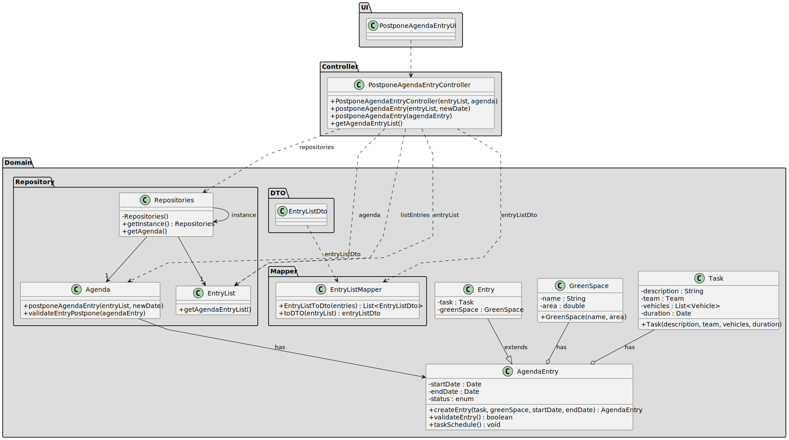

# US024 - Postpone entry in the Agenda

## 3. Design - User Story Realization 

### 3.1. Rationale

_**Note that SSD - Alternative One is adopted.**_

| Interaction ID | Question: Which class is responsible for...   | Answer                  | Justification (with patterns)                                                                                 |
|:---------------|:----------------------------------------------|:------------------------|:--------------------------------------------------------------------------------------------------------------|
| Step 1  		     | 	... interacting with the actor?              | PostponeEntryUI         | Pure Fabrication: there is no reason to assign this responsibility to any existing class in the Domain Model. |
| 			  		        | 	... coordinating the US?                     | PostponeEntryController | Controller                                                                                                    |
| Step 2  		     | 	...showing the existing entry's					         | TaskRepository          | Repository                                                                                                    |
| 	Step 3		  		  |                                               |                         |                                                                                                               |
| Step 4  	  		  | 	                                             |                         |                                                                                                               |
| 	Step 5	  		   | 	                                             |                         |                                                                                                               |
| 	Step 6	  		   | 	                                             |                         |                                                                                                               |
| Step 7  		     | 	...saving the inputted data?                 | TaskRepository          | IE: object Task has its own data.                                                                             |
| 		             | 	... validating all data (local validation)?  | Task                    | IE: owns its data.                                                                                            | 
| 			  		        | 	... validating all data (global validation)? | TaskRepository          | IE: knows all its entry's.                                                                                    | 
| 			  		        | 	... saving the new entry date?               | TaskRepository          | IE: owns all its entry's.                                                                                     | 
| Step 8  		     | 	... informing operation success?             | PostponeEntryUI         | IE: is responsible for user interactions.                                                                     | 

### Systematization ##

According to the taken rationale, the conceptual classes promoted to software classes are: 

* TaskRepository
* Task

Other software classes (i.e. Pure Fabrication) identified: 

* PostponeEntryUI  
* PostponeEntryController

## 3.2. Sequence Diagram (SD)

_**Note that SSD - Alternative One is adopted.**_

### Full Diagram

This diagram shows the full sequence of interactions between the classes involved in the realization of this user story.

## 3.3. Class Diagram (CD)

