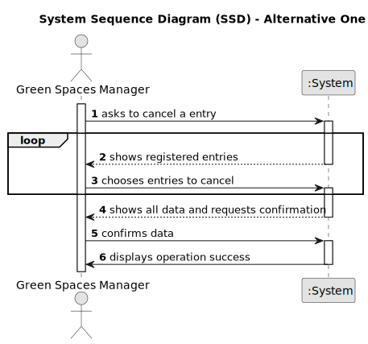

# US025 - Cancel entry in the agenda 

## 1. Requirements Engineering

### 1.1. User Story Description

The GSM wants to cancel an entry in the Agenda.

### 1.2. Customer Specifications and Clarifications

**From the client clarifications:**

> **Question:** When a task is cancelled, is it possible to put it back on the agenda again later?
> 
> **Answer:** Yes
 
> **Question:** When we cancel a task, do we move it again to the To-Do List?
> 
> **Answer:** No

> **Question:** When the GSM wants to cancel a task, this task can only be canceled if its status is PLANNED or POSTPONED, correct?
> 
> **Answer:** No, just planned because if there is a Postponed entry then there is also an Planned Entry with the new date.

 

### 1.3. Acceptance Criteria

* **AC1:** A canceled task should not be deleted but rather change its state.

### 1.4. Found out Dependencies

* One dependence with US022 has there must be an entry to cancel.

### 1.5 Input and Output Data

**Input Data:**

* Selected data:
  * the entry to cancel.

**Output Data:**

* (In)Success of the operation

### 1.6. System Sequence Diagram (SSD)

**_Other alternatives might exist._**

#### Alternative One

