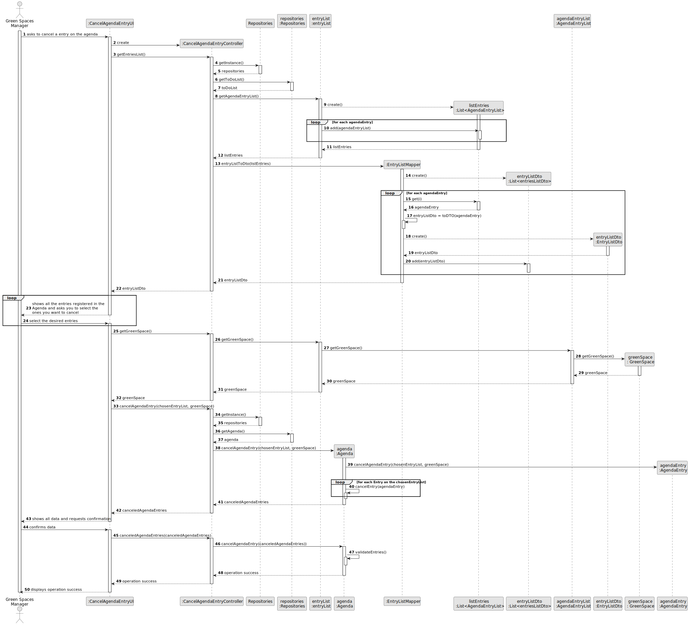
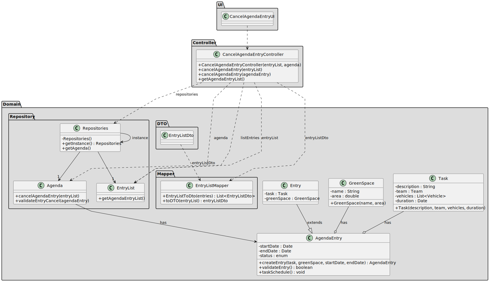

# US025 - Cancel entry in the agenda 

## 3. Design - User Story Realization 

### 3.1. Rationale

_**Note that SSD - Alternative One is adopted.**_

| Interaction ID | Question: Which class is responsible for...                | Answer                      | Justification (with patterns)                                                                                                                                     |
|:---------------|:-----------------------------------------------------------|:----------------------------|:------------------------------------------------------------------------------------------------------------------------------------------------------------------|
| Step 1         | ... interacting with the actor?                            | CancelAgendaEntryUI         | Pure Fabrication: there is no reason to assign this responsibility to any existing class in the Domain Model.                                                     |
|                | ... coordinating the US?                                   | CancelAgendaEntryController | Controller: coordinates the interactions related to canceling an agenda entry in the user interface (UI) and executes the logic needed to process these requests. |
|                | ... knowing the Agenda Entries?                            | EntryList                   | IE: knows how to access the data of entries list.                                                                                                                 |
|                | ... create a list with all the data of the Agenda?         | EntryListMapper             | IE: Transforms all of its data.                                                                                                                                   |
|                | ... creating the entry list DTO?                           | EntryListDto                | Pure Fabrication: a simple data structure to hold the list of Entries for transfer.                                                                               |
|                | ... returning EntryList entries DTOs to the UI?            | CancelAgendaEntryController | Controller: coordinates the interaction and data flow between the UI and the model.                                                                               |
| Step 2         |                                                            |                             |                                                                                                                                                                   |
|                | ... knowing the green space associated with the EntryList? | EntryList                   | IE: EntryList is the most knowledgeable about its associated GreenSpace.                                                                                          |
|                | ... saving the inputted data?                              | AgendaEntry                 | IE: processes user input and cancels a agenda entry based on that information.                                                                                    |
|                | ... marking the status as canceled?                        | AgendaEntry                 | IE: owns the information necessary to manage its status.                                                                                                          |
|                | ... validating all data (local validation)?                | AgendaEntry                 | IE: owns its data.                                                                                                                                                |
| Step 4         |                                                            |                             |                                                                                                                                                                   |
| Step 5         | ... validating all data (global validation)?               | Agenda                      | IE: knows all its agenda entries.                                                                                                                                 |
|                | ... saving the canceled agenda entry?                      | Agenda                      | IE: owns all its agenda entries.                                                                                                                                  |
| Step 6         | ... informing operation success?                           | CancelAgendaEntryUI         | IE: is responsible for user interactions.                                                                                                                         |

### Systematization ##

According to the taken rationale, the conceptual classes promoted to software classes are: 

* EntryListMapper
* EntryList
* EntryListDto
* AgendaEntry
* AgendaEntryDto
* Agenda

Other software classes (i.e. Pure Fabrication) identified: 

* CancelAgendaEntryUI  
* CancelAgendaEntryController

## 3.2. Sequence Diagram (SD)

_**Note that SSD - Alternative Two is adopted.**_

### Full Diagram

This diagram shows the full sequence of interactions between the classes involved in the realization of this user story.

## 3.3. Class Diagram (CD)

