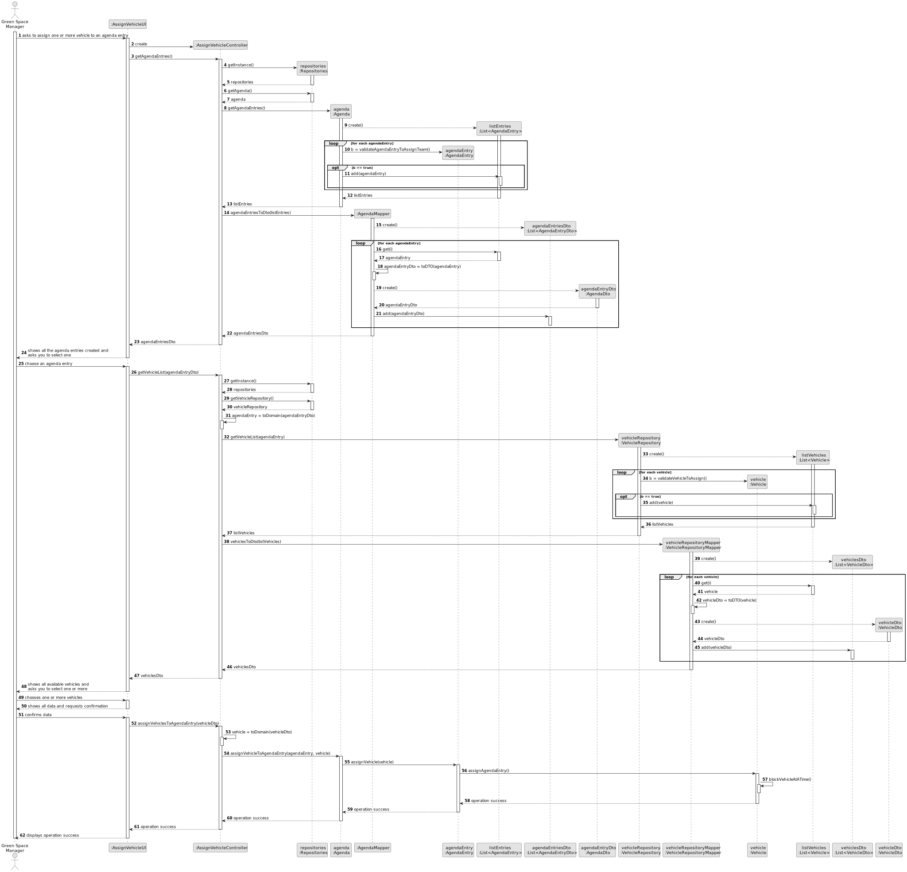

# US026 - Assign one or more Vehicles to an entry 

## 3. Design - User Story Realization 

### 3.1. Rationale

_**Note that SSD - Alternative One is adopted.**_

| Interaction ID | Question: Which class is responsible for...                                                      | Answer                  | Justification (with patterns)                                                                                                                                                                        |
|:---------------|:-------------------------------------------------------------------------------------------------|:------------------------|:-----------------------------------------------------------------------------------------------------------------------------------------------------------------------------------------------------|
| Step 1         | ... interacting with the actor?                                                                  | AssignVehicleUI         | Pure Fabrication: there is no reason to assign this responsibility to any existing class in the Domain Model.                                                                                        |
|                | ... coordinating the US?                                                                         | AssignVehicleController | Controller: coordinates the interactions related to assign vehicles to agenda entry in the user interface (UI) and executes the logic needed to process these requests.                              |
|                | ... knowing the agenda entries?                                                                  | Agenda                  | IE: knows how to access the data of agenda entries.                                                                                                                                                  |
|                | ... create a list with all the data of Agenda?                                                   | AgendaMapper            | Indirection: It introduces an intermediate layer to transform domain entities into DTOs, promoting separation of responsibilities and low coupling.                                                  |
|                | ... by checking which agenda entries can be assigned vehicles?                                   | AgendaEntry             | IE: owns its data.                                                                                                                                                                                   |
|                | ... encapsulating the data of a agenda into a DTO?                                               | AgendaEntryDto          | Indirection: Represents agenda entry data in a simplified format for transfer between application layers, promoting separation of concerns.                                                          |
|                | ... returning agenda entries DTOs to the UI?                                                     | AssignVehicleController | Controller: coordinates the interaction and data flow between the UI and the model.                                                                                                                  |
| Step 2         |                                                                                                  |                         |                                                                                                                                                                                                      |
| Step 3         | ... convert agendaEntryDto into a domain entity?                                                 | AssignVehicleController | Controller: Responsible for mediating the conversion of agendaEntryDto into a domain entity (AgendaEntry), centralising the transformation logic and maintaining the separation of responsibilities. |
|                | ... knowing the vehicles?                                                                        | VehicleRepository       | IE: knows how to access the data of vehicles.                                                                                                                                                        |
|                | ... create a list of all valid VehicleRepository data?                                           | VehicleRepositoryMapper | Indirection: It introduces an intermediate layer to transform domain entities into DTOs, promoting separation of responsibilities and low coupling.                                                  |
|                | ... to check if the vehicle can be added to the agenda entry?                                    | Vehicle                 | IE: owns its data.                                                                                                                                                                                   |
|                | ... encapsulating the data of a vehicle repository into a DTO?                                   | VehicleDto              | Indirection: Represents vehicle data in a simplified format for transfer between application layers, promoting separation of concerns.                                                               |
|                | ... returning teams DTOs to the UI?                                                              | AssignVehicleController | Controller: coordinates the interaction and data flow between the UI and the model.                                                                                                                  |
| Step 4         |                                                                                                  |                         |                                                                                                                                                                                                      |
| Step 5         |                                                                                                  |                         |                                                                                                                                                                                                      |
| Step 6         |                                                                                                  |                         |                                                                                                                                                                                                      |
| Step 7         | ... convert vehicleDto into a domain entity?                                                     | AssignVehicleController | Controller: Responsible for mediating the conversion of teamDto into a domain entity (Vehicle), centralising the transformation logic and maintaining the separation of responsibilities.            |
|                | ... assigning the vehicle?                                                                       | Agenda                  | Creator (Rule 2): the Agenda assigns vehicles to the agendaEntry instance.                                                                                                                           |
|                | ... by blocking the possibility of a team being assigned to two agenda entries at the same time? | Vehicle                 | IE: owns its data.                                                                                                                                                                                   |
|                | ... saving the new vehicle assigned to a agenda entry?                                           | Agenda                  | IE: owns all its agenda entries.                                                                                                                                                                     |
| Step 8         | ... informing operation success?                                                                 | AssignVehicleUI         | IE: is responsible for user interactions.                                                                                                                                                            |

### Systematization ##

According to the taken rationale, the conceptual classes promoted to software classes are: 

* Agenda
* AgendaMapper
* AgendaEntry
* AgendaEntryDto
* VehicleRepository
* VehicleRepositoryMapper
* Vehicle
* VehicleDto

Other software classes (i.e. Pure Fabrication) identified: 

* AssignVehicleUI  
* AssignVehicleController

## 3.2. Sequence Diagram (SD)

_**Note that SSD - Alternative Two is adopted.**_

### Full Diagram

This diagram shows the full sequence of interactions between the classes involved in the realization of this user story.

## 3.3. Class Diagram (CD)

