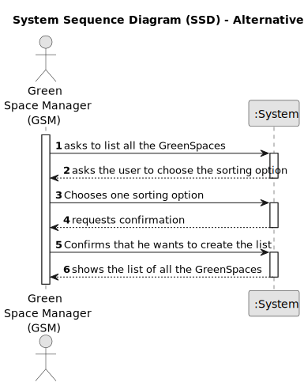

# US027 - List GreenSpaces

## 1. Requirements Engineering

### 1.1. User Story Description

As a GSM, I need to list all green spaces managed by me.

### 1.2. Customer Specifications and Clarifications 

**From the project statement document:**

> The green spaces for collective use managed by MS can significantly vary in size and installed equipment:
> 

> Garden - garden space with or without trees with little or no equipment (may have a basic irrigation system or/and benches);
>

> • Medium-sized park - green space with a few hundred or thousands of square meters with a wooded garden area, it includes some infrastructures such as toilets, drinking fountains, irrigation system, lighting,
children’s playground (for example, Quinta do Covelo, Jardim d’Arca
de Água );
>

> • Large-sized park - multi-function space with diverse garden spaces, and
woods, including varied equipment and services (for example, Parque
da Cidade).
> 

**From the client clarifications:**

> **Question:**  Dear client, which info about Green Spaces do you want the GSM see when listing? only the name ?
> 
> **Answer:** Each team can decide about the aspects related to UX/UI.

### 1.3. Acceptance Criteria

* **AC1:** The list of green spaces must be sorted by size in descending order. The sorting algorithm to be used by the application
  must be defined through a configuration file. At least two sorting
  algorithms should be available.

### 1.4. Found out Dependencies

* There is a dependency on **US020 - Register a GreenSpace** since it needs at least one GreenSpace to be able to list them

### 1.5 Input and Output Data

**Input Data:**

* Selected Data:
    * The sorting option chosen
  
**Output Data:**

* (In)Success of the operation 

* List of all GreenSpaces

### 1.6. System Sequence Diagram (SSD)

**_Other alternatives might exist._**

#### Alternative One

