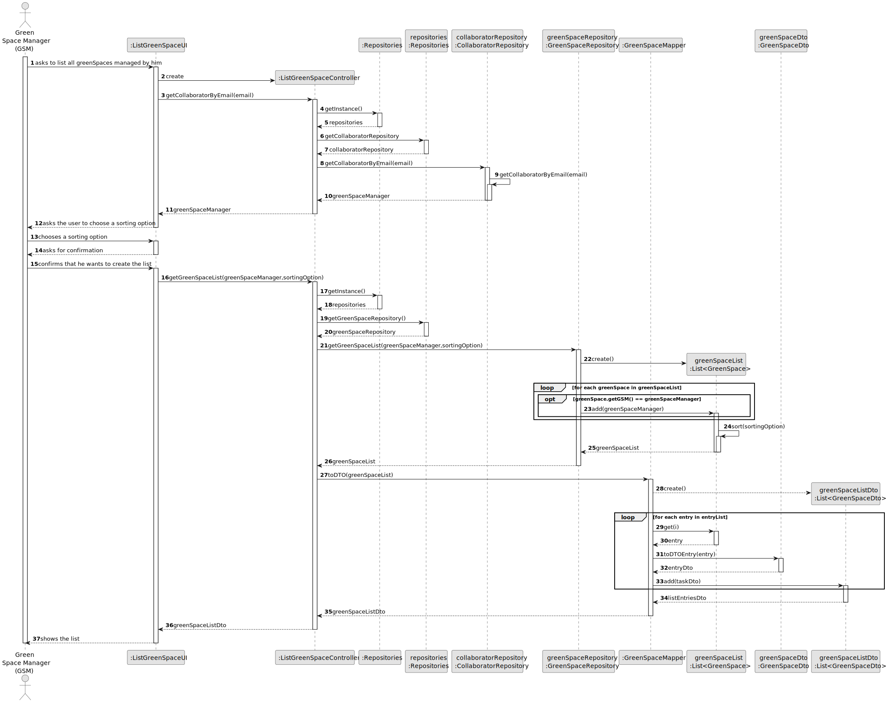
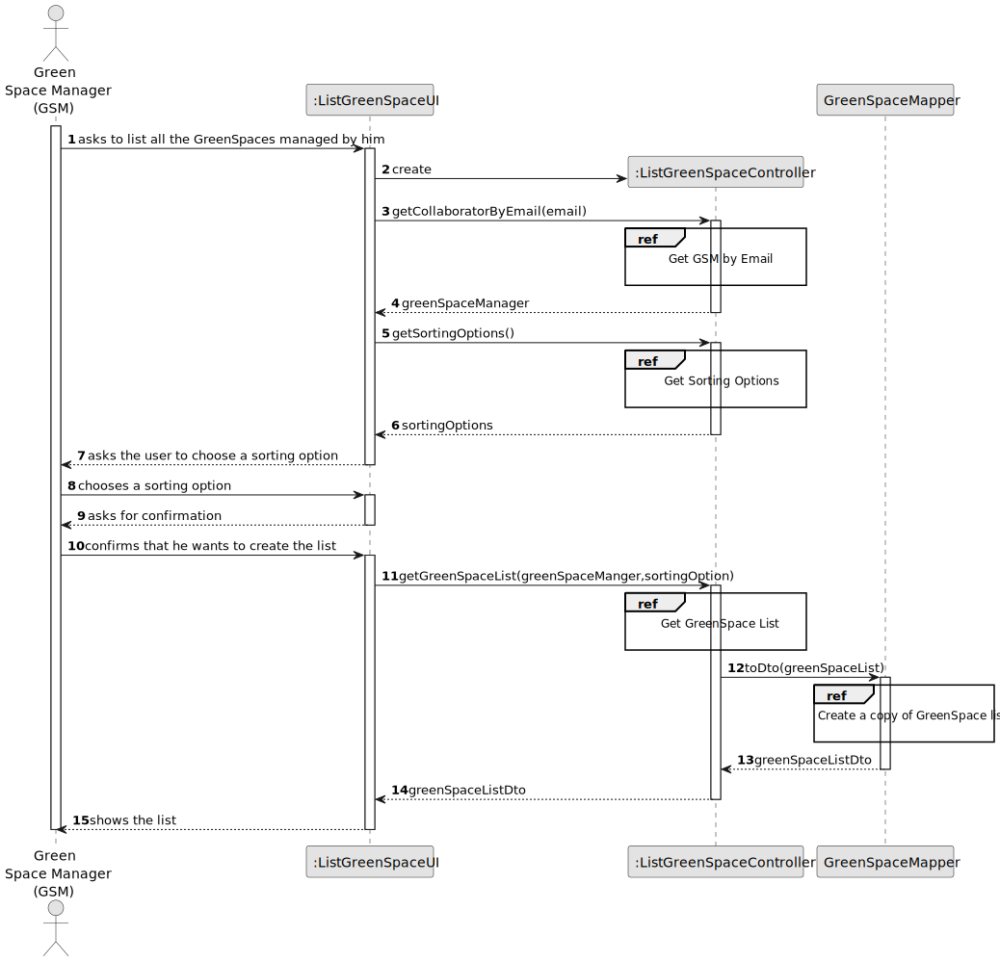
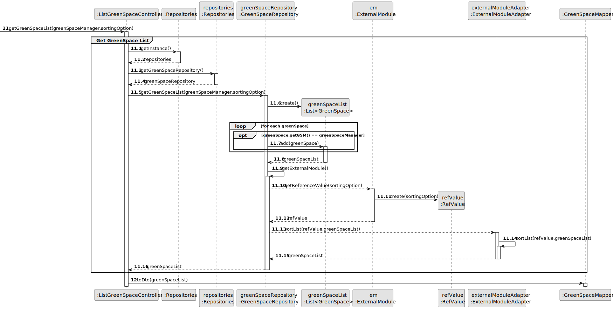
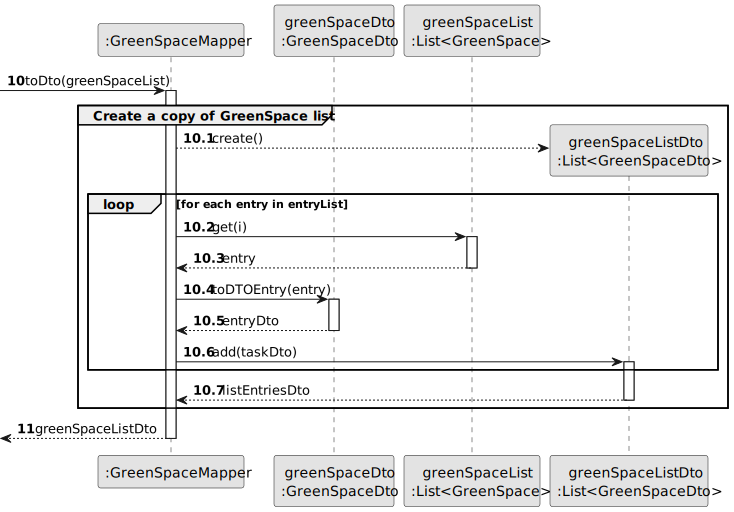
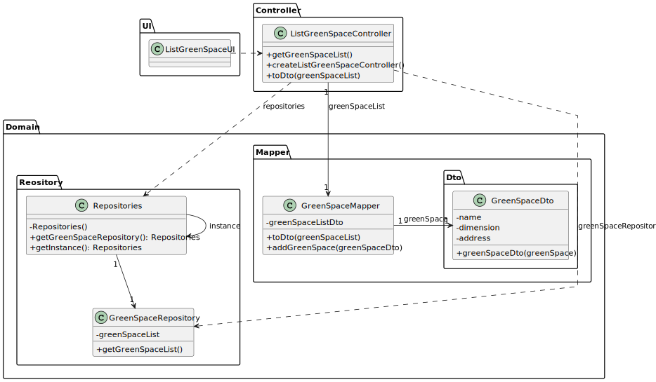

# US027 - List GreenSpaces 

## 3. Design - User Story Realization 

### 3.1. Rationale

_**Note that SSD - Alternative One is adopted.**_

| Interaction ID | Question: Which class is responsible for...            | Answer                   | Justification (with patterns)                                                                                                                                   |
|:---------------|:-------------------------------------------------------|:-------------------------|:----------------------------------------------------------------------------------------------------------------------------------------------------------------|
| Step 1  		     | 	... interacting with the actor?                       | ListGreenSpaceUI         | Pure Fabrication: there is no reason to assign this responsibility to any existing class in the Domain Model.                                                   |
| Step 2  		     | 	 						                                               |                          |                                                                                                                                                                 |
| Step 3	        | 	... coordinating the US?                              | ListGreenSpaceController | Controller: coordinates the interactions related to creating the tasks list in the user interface (UI) and executes the logic needed to process these requests. |
| 		             | 	...getting the GreenSpace list?                       | GreenSpaceRepository     | IE: owns all of its GreenSpaces.                                                                                                                                |
|                | ... create a list with all the data of greenSpaceList? | GreenSpaceMapper         | IE: Transforms all of its data.                                                                                                                                 |
|                | ... transform a greenSpace into data?                  | GreenSpaceDto            | IE: Transforms all of is data.                                                                                                                                  |
| Step 4  		     | 	...showing the GreenSpaces list?                      | ListGreenSpaceUI         | IE: is responsible for user interactions.                                                                                                                       |

### Systematization ##

According to the taken rationale, the conceptual classes promoted to software classes are: 

* GreenSpaceRepository
* GreenSpaceMapper
* GreenSpaceDto

Other software classes (i.e. Pure Fabrication) identified: 

* ListGreenSpaceUI  
* ListGreenSpaceController

## 3.2. Sequence Diagram (SD)

_**Note that SSD - Alternative One is adopted.**_

### Full Diagram

This diagram shows the full sequence of interactions between the classes involved in the realization of this user story.

### Split Diagrams

The following diagram shows the same sequence of interactions between the classes involved in the realization of this user story, but it is split in partial diagrams to better illustrate the interactions between the classes.

It uses Interaction Occurrence (a.k.a. Interaction Use).

**Get GreenSpace List**

**Create a Copy of GreenSpace List**

## 3.3. Class Diagram (CD)

