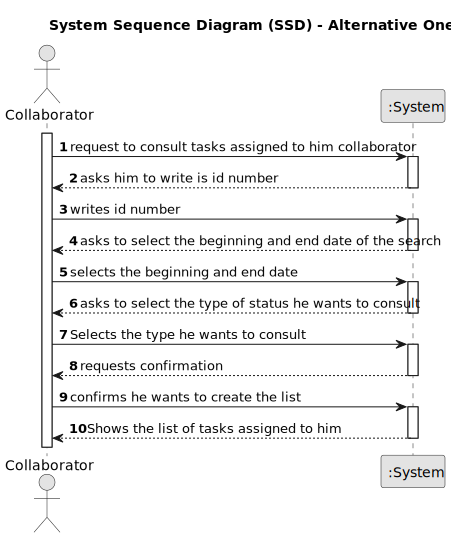

# US028 - Consult Assigned Tasks 

## 1. Requirements Engineering

### 1.1. User Story Description

As a Collaborator, I wish to consult the tasks assigned to me between two dates

### 1.2. Customer Specifications and Clarifications 

**From the project statement document:**

> Tasks are carried out on an occasional or regular basis, in one or more
green spaces, for example: tree pruning, installation of an irrigation system,
and installation of a lighting system.

**From the client clarifications:**

> **Question:** Could a task belong to different teams and collaborators? I mean, if the status, degree of urgency and expect duration belong to an entry of the to do list and the task is something generic that can be reuse, or if the task could belong only to one collaborator,
> and for another you have to create another one.
> 
> **Answer:** No.
>Maybe a distintion should be made between type of task and a task.
>Task type is "Prunning trees", a specific task is "Prunning trees" in specific park in a specific date.
> 

> **Question:** A collaborator could have assigned at the same time different tasks from different teams, isnt it?
>  
> **Answer:** No, in a specific period (for instance during a week) a collaborator just belongs to team. But if you consider a wider period you may find different teams to which a collaborator belonged.

> **Question:** Apart, which atributes has a task ( maybe something like: name, frequency, creation_date, lenght, status)? Which id do you want (I think name is not a good idea)? Which status could a task have?
> 
> **Answer:** In this project no distinction will be made between recorrent/occasional tasks; I suppose that the identification is a combination of Name, Date and Local, like Prunning Trees at 20/05/2024 in Parque da Cidade.

> **Question:** What is the definition of an entry?
> 
> **Answer:** Not sure if fully understand you question. There are Agenda Entries and To-do List Entries.
A To-Do list is a list of "tasks" one need to do, each "task" one insert in the list is an Entry.
Agenda and its Entries, follow the same logic.
 
> **Question:** "As a Collaborator, I wish to consult the tasks assigned to me". That means that the collaborator can have more than one task assigned to them. To ensure that, the same task should be availvable for more than one team, am I right? The reason for that question is so that if a task is strictly related to only one team, a collaborator will end up being in two teams simultaneously, which cannot happen.
>
> **Answer:** A team can have multiple task assigned, hence, if a collaborator belongs to a team.
Besides, a collaborator can move from a team to another, so during, for instance, a month period a collaborator can belong to multiples teams.
Best regards.

### 1.3. Acceptance Criteria

* **AC1:** The list of green spaces must be sorted by date.
* **AC2:** The Collaborator should be able to filter the results by the
  status of the task.

### 1.4. Found out Dependencies

* There is a dependency on the US023 - Assign a Entry to a Team, since the tasks are assigned to the collaborator through the team.

### 1.5 Input and Output Data

* Selected Data:
    * begin data  

    * end data

    * Type of status to view: (To-Do, Done, In progress, etc.)

**Output Data:**

* List of all tasks assigned to the collaborator

### 1.6. System Sequence Diagram (SSD)

**_Other alternatives might exist._**

#### Alternative One

