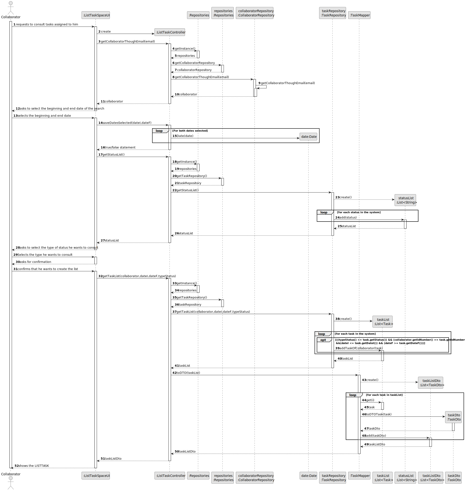
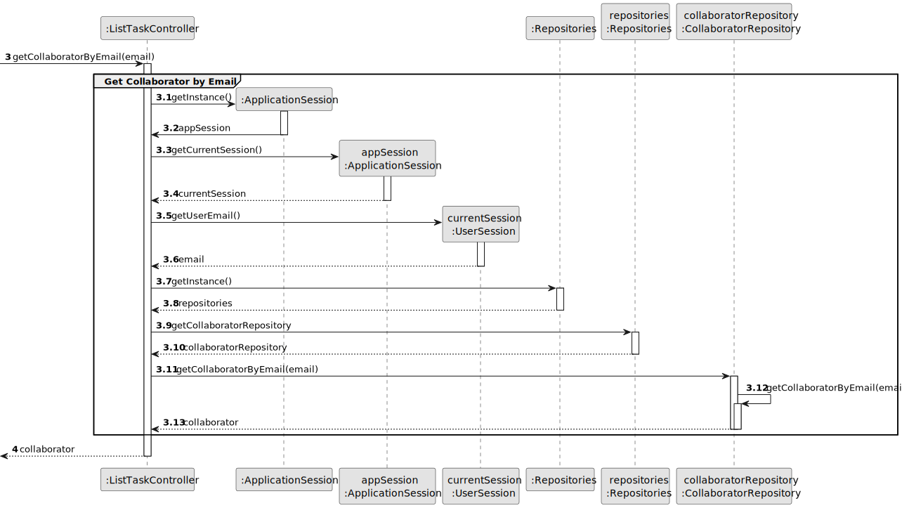
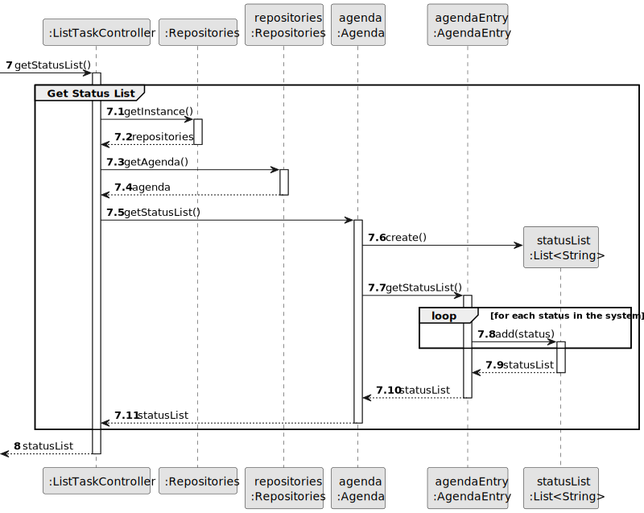
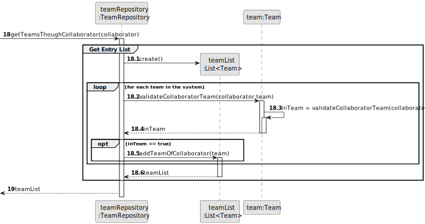
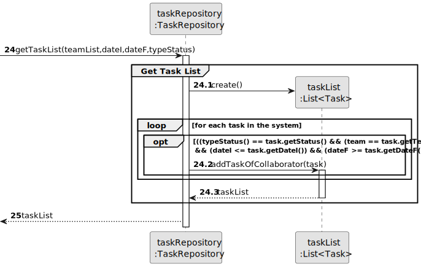
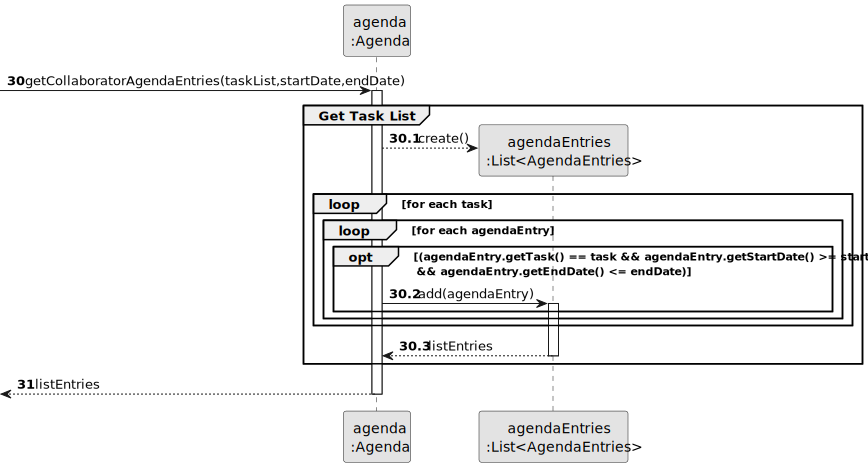
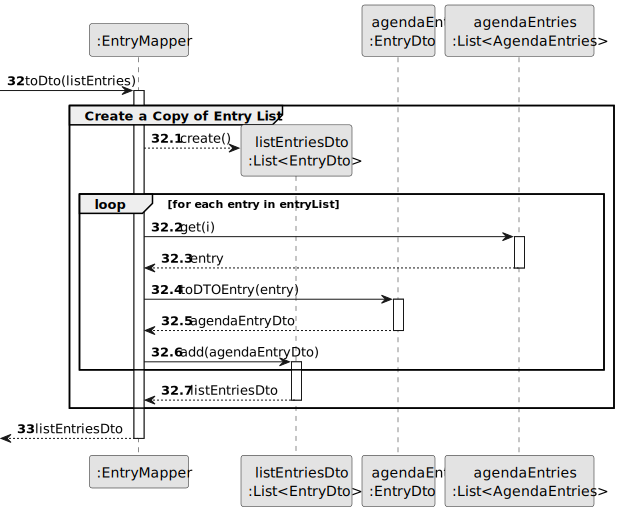
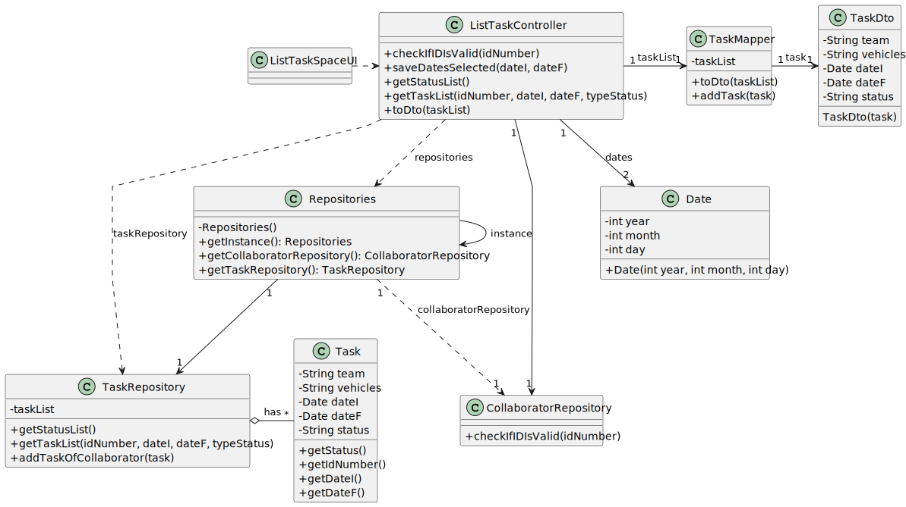

# US028 - Consult Assigned Tasks

## 3. Design - User Story Realization 

### 3.1. Rationale

_**Note that SSD - Alternative One is adopted.**_

| Interaction ID | Question: Which class is responsible for...                         | Answer                 | Justification (with patterns)                                                                                                                                   |
|:---------------|:--------------------------------------------------------------------|:-----------------------|:----------------------------------------------------------------------------------------------------------------------------------------------------------------|
| Step 1  		     | 	... interacting with the actor?                                    | ListTasksUI            | Pure Fabrication: there is no reason to assign this responsibility to any existing class in the Domain Model.                                                   |
| 	              | 	... coordinating the US?                                           | ListTasksController    | Controller: coordinates the interactions related to creating the tasks list in the user interface (UI) and executes the logic needed to process these requests. |
|                | ... knows all of its collaborators?                                 | CollaboratorRepository | IE: knows all of the collaborators.                                                                                                                             |
|                | ... has all of the collaborators?                                   | CollaboratorRepository | IE: has all of its  collaborators.                                                                                                                              |
| Step 2         |                                                                     |                        |                                                                                                                                                                 |
| Step 3         | ... getting a list of all status?                                   | TaskRepository         | IE: Knows all types of status.                                                                                                                                  |
| Step 4         |                                                                     |                        |                                                                                                                                                                 |
| Step 5         |                                                                     |                        |                                                                                                                                                                 |
| Step 6         |                                                                     |                        |                                                                                                                                                                 |
| Step 7         | ...getting the Team list?                                           | TeamRepository         | IE: owns all of its teams.                                                                                                                                      |
|                | ...knows which team the collaborator is part of?                    | TeamRepository         | IE: knows which collaborators are present in each team                                                                                                          |
|                | ...validates the team where the collaborator is(local validation)?  | Team                   | IE: knows all of the collaborators in the team.                                                                                                                 |
|                | ...validates the team where the collaborator is(global validation)? | TeamRepository         | IE: knows which collaborators are present in each team                                                                                                          |
| 		             | 	...getting the Task list?                                          | TaskRepository         | IE: owns all of its tasks.                                                                                                                                      |
|                | ... creating a list of all the tasks related to the collaborator?   | TaskRepository         | IE: owns all of its tasks.                                                                                                                                      |
|                | ... getting the Entry list                                          | Agenda                 | IE: owns all of the agendaEntries that are Entries.                                                                                                             |
|                | ... creating a list of entries to save the collaborator tasks?      | Agenda                 | IE: owns all and knows all the tasks in the system.                                                                                                             |
|                | ... create a list with all the data of entryList?                   | EntryMapper            | IE: Transforms all of its data.                                                                                                                                 |
|                | ... transform a entry into data?                                    | EntryDto               | IE: Transforms all of is data.                                                                                                                                  |
| Step 8  	      | 	...showing the task list?                                          | ListTasksUI            | IE: is responsible for user interactions.                                                                                                                       |

### Systematization ##

According to the taken rationale, the conceptual classes promoted to software classes are: 

* CollaboratorRepository
* Date
* TaskRepository
* TaskMapper
* TaskDto

Other software classes (i.e. Pure Fabrication) identified: 

* ListTaskUI  
* ListTaskController

## 3.2. Sequence Diagram (SD)

_**Note that SSD - Alternative One is adopted.**_

### Full Diagram

This diagram shows the full sequence of interactions between the classes involved in the realization of this user story.

### Split Diagrams

The following diagram shows the same sequence of interactions between the classes involved in the realization of this user story, but it is split in partial diagrams to better illustrate the interactions between the classes.

It uses Interaction Occurrence (a.k.a. Interaction Use).

**Get Collaborator by Email Partial SD**

**Get Status List Partial SD**

**Get Team List Partial SD**

**Get Task List Partial SD**

**Get Entry List Partial SD**

**Create a Copy of Entry List Partial SD**

## 3.3. Class Diagram (CD)

