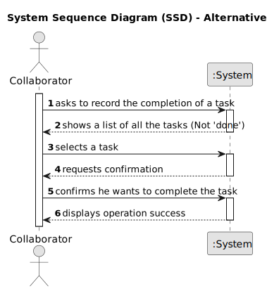

# US029 - Record the Completion of a Task

## 1. Requirements Engineering

### 1.1. User Story Description

As a Collaborator, I want to record the completion of a task.

### 1.2. Customer Specifications and Clarifications

**From the project statement document:**

> The To-Do List comprises all the tasks required to be done in order to assure the proper functioning of the parks. These tasks can be regular (e.g., pruning trees) or occasional (e.g., repairing a broken piece of equipment). They may also require a multi-disciplinary team, and the length of the task can vary from a few minutes (e.g., replacing a light bulb) to weeks (e.g., installing an irrigation system).
>
> The Agenda is made up of entries that relate to a task (which was previously in the To-Do List), the team that will carry out the task, the vehicles/equipment assigned to the task, expected duration, and the status (Planned, Postponed, Canceled, Done).

**From the client clarifications:**

> **Question:** 
>
> **Answer:** 

> **Question:** 
>
> **Answer:** 

> **Question:** 
>
> **Answer:** 

### 1.3. Acceptance Criteria

* **AC1:** The Collaborator must be able to mark a task as completed.
* **AC2:** The status of the corresponding Agenda entry should be updated to "Done".
* **AC3:** The completion date must be recorded.

### 1.4. Found out Dependencies

* There is a dependency on **"US022 - Add a new Entry in the Agenda"**, since the tasks to be marked as completed must exist in the Agenda.
* There is a dependency on **"US023 - Assign a Team to an entry in the Agenda"**, since tasks must be assigned to a Collaborator.

### 1.5 Input and Output Data

**Input Data:**

* Selection of the task from the Agenda.
* The completion date.

**Output Data:**

* The updated status of the task in the Agenda.
* (In)Success of the operation

### 1.6. System Sequence Diagram (SSD)

**_Other alternatives might exist._**

#### Alternative One

